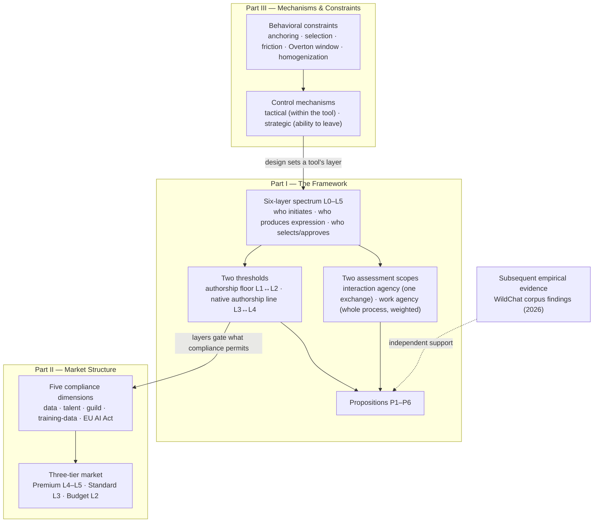

# Distributed Agency in Human-AI Systems: A Framework for Analyzing Authorship, Control, and Autonomy

## Investigating Authorship in AI-Participated Creative Work

> *A note on copyright: the three-zone model reflects current US Copyright Office guidance — the Zarya of the Dawn registration, the March 2023 statement of policy on AI-generated works, and the 2025 AI report on copyrightability. Copyright law in this area is actively evolving and varies by jurisdiction. This document offers a strategic and operational framework, not legal advice. For specific registration decisions, consult counsel or the published guidance directly.*

---

We have arrived at design crossroads where the objective is no longer the capability of the machine, but the preservation of the user. This critical inflection point demands a shift from efficiency-centered design to judgment-centered design.

If our systems are architected to amplify the human capacity for taste, imagination and creativity, AI becomes a catalyst for evolution. If, however, we design for the total removal of friction, we inadvertently design for the obsolescence of human thought and the erosion of our capacity to grow.

This document is a view into how artists (and industry) can navigate the pressures on storytelling in a generated world, by understanding agency at the tool level, and moving past the unsustainable good/bad binary.

This framework emerged from building a human-led storytelling system (Narrative.new): a narrative development environment designed so that AI supports planning, structure, and suggestion while expression remains the writer's. Designing it meant deciding, interface choice by interface choice, where control sits between writer and machine. Those decisions required a way to describe how interaction and design shape creative autonomy and authorship — the vocabulary this document generalizes.

At this technological inflection point, creators, studios, and industry professionals find themselves navigating without a shared vocabulary, allowing for a shared feeling of "you're on your own." The existing language ("AI-generated," "AI-assisted," "human-written") fails to capture the spectrum of configurations actually in use. The scaffolding to build from is needed. Guild contracts reference "human-led" processes without defining the threshold. Copyright law requires "significant human control" without specifying what qualifies. Tool interfaces make design choices that shape agency without making those choices visible. Everyone operates from intuition where precision is needed.

## Defining the Framework

To address this gap, this document proposes a six-layer model (L0-L5) that maps qualitative standards to operational configurations. It synthesizes legal requirements (USCO, EU AI Act), professional standards (WGA, SAG-AFTRA, DGA), cognitive research on human-AI interaction, and market analysis of compliance constraints. The result is a vocabulary for discussing agency that connects to the rules already governing professional work.

**Objective and contributions.** The objective is a shared, operational vocabulary for how creative agency and authorship distribute between humans and AI. Four contributions, each marked by status so it is clear what is proposed here versus summarized from public sources:

1. **The six-layer taxonomy (L0–L5)** — new. A classification of human-AI configurations defined on consistent axes (who initiates, who produces expression, who selects and approves), with boundaries anchored to breakpoints that already exist in law and professional standards rather than to an invented scale. Leveled scales of AI use exist in adjacent domains (educational assessment, agent autonomy; see Related Work); the novelty is grading authorship distribution in completed creative works, and the anchoring itself.
2. **The two-level assessment model** — new. The distinction between interaction agency (a single exchange) and work agency (a completed work), with a weighted contribution model for the latter. This distinction names a measurement gap later documented independently at corpus scale (see Subsequent Empirical Evidence).
3. **The two-threshold interpretation** — new interpretation of synthesized material. The claim that four independent standards (copyright, guild, cognitive, economic) converge near the L3/L4 boundary, while the legal floor sits separately at L1/L2.
4. **The compliance-to-market mapping** — synthesis with new structure. The legal and guild material summarizes public sources; the contribution is the mapping from compliance dimensions to a three-tier market structure, and the mechanism and behavioral analysis of how interface design preserves or erodes agency.

What this document is not: a formal empirical study. The framework is a conceptual and design-research contribution. Its development process is described in The Approach, the status of its numeric values is stated where each appears, and its validation path is discussed in Limitations.

## Framing - Essential Context

To accurately apply this framework, three distinctions regarding creative reality versus legal definition must be made:

**Process Over Tooling:** Authorship is a function of how a tool is used, not merely which tool is used. A "low-agency" tool can be operated with high human intent (e.g., using a chatbot as a rigorous planning partner), just as a "high-agency" tool can be used passively. The framework measures human leverage and intent, not just software capability.

**Creative vs. Legal Timelines:** While legal standards regarding AI output remain in development and often lag behind technological capabilities, this framework addresses the immediate creative conversation. This document attempts to define a creative standard for authorship that posits where the legal frameworks will eventually align.

**Agency as a Spectrum:** The levels presented here are not binary audits. They are a qualitative map of gradients. It should be acknowledged that the threshold for ownership is often deeply personal; this map identifies where human leverage is maximized to ensure the creator remains the architect of the narrative.

> *Scope of Analysis: This work centers on authorship and agency within text-based generative processes. Multimodal concerns (voice, likeness, and visual generation) are addressed only where they intersect with writing; full treatment of these areas is reserved for future study. The analysis specifically targets the pre-rendering/pre-visualization phase rather than final output.*

---

## Contents

- [The Shape of the Argument](#the-shape-of-the-argument)
- [The Human-AI Agency Spectrum](#the-human-ai-agency-spectrum)
- [Part I: The Framework](#part-i-the-framework)
  - [Is There a Problem with the Problem](#is-there-a-problem-with-the-problem)
  - [The Six Layers of Agency](#the-six-layers-of-agency)
  - [The 90% Threshold: The Professional Safe Harbor](#the-90-threshold-the-professional-safe-harbor)
  - [Work-Level Agency: The Iterative Dimension](#work-level-agency-the-iterative-dimension)
  - [Iterative Workflow Case Studies](#iterative-workflow-case-studies)
  - [The Framework's Propositions](#the-frameworks-propositions)
- [Part II: Market Structure](#part-ii-market-structure)
  - [The Compliance Landscape](#the-compliance-landscape)
  - [The Three-Tier Market](#the-three-tier-market)
- [Part III: Mechanisms & Constraints](#part-iii-mechanisms--constraints)
  - [Mechanisms of Control](#mechanisms-of-control)
  - [Behavioral Constraints](#behavioral-constraints)
- [Related Work](#related-work)
- [Subsequent Empirical Evidence](#subsequent-empirical-evidence)
- [Limitations](#limitations)

---

## The Shape of the Argument

The framework has three moving parts, and they stack:



**Part I** defines the vocabulary: six layers on three consistent axes, two thresholds anchored in external standards, and two assessment scopes — a single interaction versus a completed work. Its output is a set of testable propositions (P1-P6).

**Part II** consumes the layer classifications: five compliance dimensions gate which layers are permissible for which work, and their intersection stratifies the market into three tiers.

**Part III** explains what moves a configuration along the spectrum: control mechanisms within and across tools, and the behavioral constraints operating beneath apparent choice.

A closing section reports independent empirical findings that postdate the framework's publication.

Readers deciding tool policy can stop after Part I. Readers positioning productions or products need Part II. Readers designing tools need Part III.

---

# The Human-AI Agency Spectrum

---

# Part I: The Framework

---

## Is There a Problem with the Problem

---

When a large language model generates text, is it writing? When ChatGPT produces a scene, did it write that scene? When an AI tool suggests a paragraph, who authored it? When an AI completes your sentence, whose sentence is it?

Skeptics say concrete logic: it's pattern matching, not writing. Embracers say look at the output, it's indistinguishable. Creators know they are still creators, but wonder if an undiscerning audience might not care. Studios wonder who owns it. Unions wonder whose job it's replacing.

All asking the same question: Does the machine write?

---

### The Problem with the Question

Both positions accept a flawed premise: that machine authorship is binary, discoverable through analysis. Either AI writes or it doesn't. Either it's an author or it isn't.

This framing produces arguments, not answers. It generates social and philosophical heat without offering actual practical guidance.

---

### The Shift

**From:** Does the machine write? (ontology) **To:** How does the system distribute the act of writing? (configuration)

| From | To |
|---|---|
| Binary (Yes/No) | Qualitative (Spectrum of layers) |
| Ontological question | Architectural description |
| Verdicts | Gradations |

Authorship isn't a property that resides in either human or machine. The well-worn printing press example offers an analog: the printing press introduced new roles: the typesetter, the proofreader, the publisher. The author's control over the final product was distributed across this new technological/labor system.

It's a configuration that emerges from how they interact. The same AI model in different interfaces produces different authorship distributions. The model is identical. The distribution of who's writing is not.

---

### The Same Model, Different Distributions

The underlying AI model is often identical, but the interface sets the dial on authorship:

**Chatbot Interface:** You prompt, it generates, you accept/reject (L0-L1).

**Embedded Suggestion Mode:** You write, it offers phrases, you select (L3).

**Structural Assistance:** It outlines, you write all expression (L4).

---

### Why This Matters

For creators: the question is credit and ownership. When is the work yours?

For studios: the question is liability and compliance. What's defensible? What satisfies guild requirements?

For unions: the question is labor and compensation. What protects members? What counts as their work?

All three need the same thing: a way to measure and specify how authorship gets distributed between humans and machines.

---

### The Approach

This framework is a conceptual and design-research contribution, not a formal empirical study. No dataset, participant pool, or statistical analysis stands behind it, and this document does not claim otherwise. Its method combines three things:

**Design research.** The framework emerged from building Narrative.new, a storytelling system intended to keep the writer the primary author. Every interface decision — suggest or publish defaults, where drafts originate, what the AI may touch — forced the same question: where does this put control? The six layers began as the working answers.

**Conceptual analysis.** The same foundation model behind different interfaces (chatbot, embedded suggestion, structural assistance) produces different authorship distributions. Examining tool architectures in professional use showed that the configurations cluster, and that the clusters differ on three recurring axes: who initiates, who produces expression, who selects and approves.

**Standards synthesis.** Copyright guidance, guild agreements, and the EU AI Act each draw qualitative lines ("significant human control," "human-led," "assistive function"). Reading them against the clustered configurations showed the lines land at consistent places on the spectrum — the anchoring argument developed in the sections that follow.

The result: **a two-level distributional model, authorship risk as the central metric, and six interaction layers.** A map of authorship allocation across interaction architectures. Essentially a "you are here."

The derivation of the layer count and boundaries is taken up in The Six Layers of Agency. The status of every numeric value in this document — design choice versus evidence-anchored — is stated where it appears.

---

### What Follows

An examination of why existing approaches don't answer the questions creators, studios, and unions actually face.

The pressing question isn't whether machines write, but how different system designs distribute authorship between human and machine, and the impact of that on each stakeholder in our collective narrative landscape.

---

## The Six Layers of Agency

---

### The Six-Layer Framework (L0-L5)

To operationalize qualitative standards like "human-led" and "significant control," this framework defines six layers with indicative ranges. The layer (not the exact percentage) is the unit of practical analysis.

These ranges are directional, not precise measurements. Avoiding potentially false precision on top of inherently vague standards. A tool classified as L3 operates in the 70-89% range conceptually; practitioners need not calculate exact percentages. The value is in consistent layer classification that maps to legal and professional standards.

The percentages are design choices, not measurements: no instrument returns "82% human," and none is claimed. They are a communication device that makes ordinal positions comparable across tools, contracts, and jurisdictions. The framework's claims ride on the boundaries between layers (see Why Six Layers), not on the numerals inside them.

Every layer is defined by the same three questions: **who initiates** the work, **who produces its expression**, and **who selects and approves** what enters it. The layer names describe the human's stance at that configuration.

| Layer | Name | Indicative Range | Who Initiates | Who Produces Expression | Who Selects / Approves | Authorship Status |
|---|---|---|---|---|---|---|
| L5 | Pure Tool | ~100% | Human | Human; machine performs mechanical operations only (correction, formatting) | Human; nothing expressive to review | Unambiguous |
| L4 | Director | ~90-99% | Human | Human; machine contributes bounded assistance on command | Human reviews every machine contribution before it enters the work | Clean human |
| L3 | Supervisor | ~70-89% | Human, who drafts | Human, with machine proposing options within human-drafted material | Human selects, modifies, or rejects each suggestion | Diluted / defensible |
| L2 | Collaborator | ~40-69% | Human, who specifies (outlines, beats) | Machine drafts at passage scale from human specification | Human selects, edits, arranges | Diluted / disclosure |
| L1 | Executor | ~15-39% | Human, who prompts | Machine produces essentially all expression | Human curates: accept, regenerate, light edit | High risk |
| L0 | Oracle | ~0-14% | Human, who requests | Machine produces everything | None meaningful; human receives | No human claim |

*L3-L5 collectively constitute the "assistive function" range under EU AI Act Article 50, exempt from mandatory AI-generated content marking.*

---

### Why Six Layers

The layer count was not assumed in advance, and it is not the output of a dataset. It follows from the boundaries: five distinct breakpoints recur across the legal, professional, cognitive, and economic standards this framework synthesizes, and five breakpoints partition the spectrum into six layers.

| Boundary | What changes there | External anchor |
|---|---|---|
| L5 ↔ L4 | Machine contribution begins to touch content at all | De minimis line: purely mechanical assistance (correction, formatting) is authorship-neutral under USCO guidance |
| L4 ↔ L3 | Human stops producing all expression; machine begins proposing expression for human review | Native authorship line: USCO assistive-use pathway vs. selection/arrangement pathways; guild "human-led" standards; the cognitive shift from generating to reacting |
| L3 ↔ L2 | Machine moves from suggesting within human-drafted material to drafting from human specification | EU AI Act Art. 50(2): "assistive function" that does not "substantially alter" semantics (L3-L5, exempt) vs. marked generation (L2 and below) |
| L2 ↔ L1 | Human contribution stops qualifying as creative selection, coordination, arrangement, or modification | Authorship floor: USCO's line between documentable contribution and prompts alone |
| L1 ↔ L0 | Meaningful curation drops away; the human receives rather than selects | Conceptual endpoint: the last point at which interaction-level human choice exists at all. This boundary has no external legal anchor; both layers sit below the authorship floor, and the distinction is behavioral |

Six is a consequence, not a design target. If the governing standards drew their lines elsewhere, or a future standard added a new one, the layer count would change with them. The claim this framework makes is that these five breakpoints exist independently of it and recur across domains; the contribution is aligning them on a single spectrum. Two of the five carry most of the weight — the authorship floor at L1↔L2 and the native authorship line at L3↔L4 — and the 90% Threshold section develops why.

---

### Mapping Tools to Layers

Layers solve the problem of "collapsed distinctions." This allows distinction between tools that were previously lumped together as "AI-assisted":

**Corrective (L5):** Spell-checkers. Pure tool; no authorship impact.

**Augmentative (L4-L3):** Autocomplete. Human still leads the expression.

**Suggestive (L3-L2):** Paragraph suggesters. The distribution of agency shifts.

**Generative (L1-L0):** Full draft generators. The machine is the primary author.

### Stakeholder Applications

The Spectrum Model provides a shared vocabulary for the entire industry:

**Creators:** Use the layers to choose tools consciously. L4-L5 yields native copyright; L2-L3 yields documented copyright when authorship is preserved or contributed (chain of title required); below L2, the output isn't separately protected.

**Studios:** Specify layer requirements in contracts. Set L4-L5 as the "safe zone" for high-stakes projects and L3 for standard production with documentation.

**Unions:** Define member work by layer. Use L4-L5 as the standard for full compensation and credit, and create different structures for L2 machine-led work.

---

### The 90% Threshold

The boundary between L4 and L3 is the critical professional safe harbor: where native human authorship, guild "human-led" standards, the cognitive shift from generation to curation, and chain-of-title premiums converge. The legal floor for copyright sits lower, at L1↔L2 (see The Legal Line in the next section).

---

## The 90% Threshold: The Professional Safe Harbor

---

The boundary between L4 (~90-99%) and L3 (~70-89%) is the most significant professional line on the spectrum. It is the same line The Legal Line (below) calls the **native authorship line**: above it, copyright is native; below it (and above the L1↔L2 floor), copyright is documented. Four standards converge at this boundary: native authorship for copyright purposes, professional "human-led" standards from the guilds, the cognitive distinction between generating expression and curating machine output, and the economic premium attached to clean chain of title. Above this threshold, humans lead and machines assist; below it, the relationship inverts.

The status of this claim: the threshold is a proposed operationalization, argued from the convergence of four independently developed standards, not a measured constant. "90%" is the mnemonic for the L4/L3 boundary; the argument concerns the boundary and would survive relabeling the numeral.

---

### 1. The Legal Line (Copyright & USCO)

The U.S. Copyright Office requires "significant human control" over the specific expression, a qualitative standard that follows authorship, not operation. A work fully authored by a human at L5 keeps its copyright when later rendered at L0; the script's authorship doesn't vanish when a machine touches it. Conversely, machine-generated output from a thin prompt has no separately protectable expression, regardless of which layer surrounds it. The USCO's January 2025 guidance enumerates three pathways to copyright in AI-assisted work: assistive use of AI tools, perceptible human-authored inputs reflected in the output, and selection / coordination / arrangement / modification of AI-generated material. The framework maps these to three copyright zones across the spectrum:

| Agency Level | Copyright Zone | Basis |
|---|---|---|
| L4-L5 (90%+) | Native copyright | Human-authored expression at the moment of creation. AI assists rather than stands in for human creativity, and machine contribution is bounded and de minimis. |
| L2-L3 (40-89%) | Documented copyright | Copyright attaches to preserved or contributed human authorship: upstream human-authored material perceptible in the output, or creative selection / coordination / arrangement / modification of AI-generated material. Chain of title must be visible. Prompts alone are not sufficient. |
| L0-L1 (0-39%) | No copyright in output | Pure machine generation from prompts that do not provide sufficient control over expressive elements. Any underlying human-authored source retains its own copyright, but the output is not separately protected. |

The threshold isn't a single wall. It's two lines: the **authorship floor** at L1↔L2 (where any human authorship can be claimed) and the **native authorship line** at L3↔L4 (where authorship is native rather than documented).

> *A note on copyright: the three-zone model reflects current US Copyright Office guidance — the Zarya of the Dawn registration, the March 2023 statement of policy on AI-generated works, and the 2025 AI report on copyrightability. Copyright law in this area is actively evolving and varies by jurisdiction. This document offers a strategic and operational framework, not legal advice. For specific registration decisions, consult counsel or the published guidance directly.*

---

### 2. The Professional Line (Guild Standards)

Guild contracts require work to be "human-led," again, a qualitative standard. The framework maps this to the L4/L3 boundary: at L4-L5, the member remains the primary architect of the work, protecting "Written By" credit integrity. Falling below this line moves the creator from Director of the tool to Supervisor of machine output, complicating compensation and credit structures.

### WGA 2023 MBA Key Provisions (Article 72)

The WGA contract establishes a binary distinction—AI is not a writer—with specific terminology and asymmetric rules for studios vs. hired writers:

| WGA Term | Definition | Framework Implication |
|---|---|---|
| **Literary Material** | Written work by a *writer*; AI output explicitly excluded (Art. 72.B) | Studios cannot claim AI output as literary material at any level. Hired writers with company consent can incorporate GAI and retain literary material status at any level (Art. 72.C). |
| **Source Material** | Basis for determining credits; AI output cannot count | AI-generated material cannot establish prior work or undermine writer credit |
| **Assigned Material** | Work given to writer for compensation; AI output cannot count | Writer treated as "first writer" regardless of AI input |
| **Separated Rights** | Creative ownership interests AI cannot disqualify | AI use cannot strip separated rights from writers |

**Additional provisions:**
- **Art. 72.D:** Writers must obtain company consent before using GAI and follow company policies
- **Art. 72.E:** Companies cannot require writers to use GAI software
- **Art. 72.F:** WGA reserves the right to assert that using writers' material to train AI violates the MBA or applicable law
- **Art. 72.G:** Semi-annual meetings between studios and Guild to review AI usage practices

**The WGA position:** Neither traditional AI (CGI/VFX) nor generative AI (GAI) is a writer. No AI-generated material can be considered literary material. The WGA deliberately takes a binary approach—it does not define a spectrum of acceptable AI involvement. However, Article 72.C creates an asymmetry: when a hired writer uses GAI with company consent, the resulting written material *is* literary material regardless of how much AI was involved. This protects writer employment while preventing studios from replacing writers with AI. The framework provides the gradient the contract deliberately leaves unspecified, mapping where clean authorship (L4-L5) transitions to diluted claims that carry increasing risk even if contractually protected.

### SAG-AFTRA Four Pillars of Ethical AI (2025) and 2026 Operationalization

SAG-AFTRA's framework centers on performer agency through four requirements. The 2025 Interactive Media Agreement introduced the four pillars; the 2026 TV/Theatrical Tentative Agreement (Section 39, term July 1, 2026 – June 30, 2030) is the operative source for film and scripted television and gives each pillar concrete provisions.

| Pillar | Right | Framework Mapping | 2026 TV/Theatrical Operationalization (Sec. 39) |
|---|---|---|---|
| **Transparency** | Know intended use of likeness | Legibility principle (users know where they stand) | "Articulable business reason" for scan-consent requests (39.J); strict notice/bargaining schedule for Synthetics (39.K); training-data licensing notice (39.L) |
| **Consent** | Grant or deny permission (written, clear, reasonably specific) | Strategic agency (ability to opt out) | "No scan" replicas brought inside the EBDR consent regime (39.A); consent required for AI dubbing into other languages effective July 1, 2027 (39.D); strike-period consent integrity (39.G) |
| **Compensation** | Fair pay (on-scale with in-person performance) | Economic line protection | ICDR floor at day-performer rate plus residuals when used as a performance that would qualify a natural performer (39.C) |
| **Control** | Set limits on how, when, where, how long | Tactical agency (control within the tool) | Producer security obligations (39.H); downstream transfer compliance with 21-day Union approval (39.I); narrow biometric data prohibition for fingerprint, palmprint, iris (39.E); absolute prohibition on nude/simulated-sexual depiction of minors via digital replica, including age-up/de-age (39.F, 43.E) |

### Guild Compliance by Layer

| Guild | L4-L5 (90%+) | L3 (70-89%) | L0-L2 (<70%) |
|---|---|---|---|
| WGA (Studios) | Full credit | Not literary material | Not literary material |
| WGA (Hired Writers)* | Full credit | Literary material | Literary material |
| DGA | Compliant | Director approval required | Requires consultation |
| SAG-AFTRA | Compliant with consent (all four pillars satisfied) | Enhanced consent; control provisions | Prohibited for performance; Synthetic in a human role requires "significant additional value" beyond what a Digital Replica could provide (2026 TV/Theatrical §39.K) |

*\*Per Article 72.C: Hired writers with company consent can incorporate GAI content as literary material at any agency level. Studios cannot claim AI-generated content as literary material.*

---

### 3. The Cognitive Line (Creative Intent)

Psychologically, there is a tipping point where a human shifts from generating intent to reacting to suggestions. The framework places this at the L4/L3 boundary: at L4-L5, the human is the primary mover; below that, the "AI-loop" begins to lead the creative process, shifting cognitive load from creation to curation.

**Above 90%:** You write. The machine assists.

**Below 90%:** The machine writes. You select.

The practical test: "Did I write the words, or choose them?"

---

### 4. The Economic Line (Risk & Valuation)

From a studio and insurance perspective, IP produced at L4-L5 represents a practical "safe harbor": native copyright, lowest risk for chain-of-title challenges. Work in the L2-L3 zone carries documented copyright that requires demonstrable preservation or contribution; below L2, the output isn't separately protected at all.

| Layer | Authorship Risk | Market Implications |
|---|---|---|
| L5 | None | Native copyright. Premium valuation. Full chain of title. |
| L4 | Minimal | Native copyright. Premium valuation. |
| L3 | Moderate | Documented copyright; chain of title required. Standard valuation. |
| L2 | High | Documented copyright; heavier documentation burden. Discounted valuation. Licensing complications. |
| L0-L1 | Total | No copyright in output. Lowest valuation. Underlying human-authored source retains its own copyright. |

---

### The Convergence

Six domains. Two thresholds.

| Domain | Standard Language | Framework Interpretation |
|---|---|---|
| Legal (USCO) | "Significant human control" | L4-L5 = native copyright; L2-L3 = documented copyright (chain of title required); L0-L1 = no copyright in output |
| WGA (2023 MBA) | AI output ≠ "literary material" (Art. 72.B); writer with consent retains literary material status (Art. 72.C) | Studios: AI output excluded at all levels. Hired writers: protected at all levels, but L4-L5 carries least copyright risk |
| SAG-AFTRA (2026 TV/Theatrical §39; 2025 IMA for interactive) | Four Pillars: Transparency, Consent, Compensation, Control — operationalized with EBDR/ICDR definitions, ICDR scale + residuals floor, dubbing consent (2027), security/transfer/biometric obligations, and a "significant additional value" test for Synthetics in human roles | L4-L5 = pillars satisfied; L3 = enhanced consent; Synthetic in a human role requires bargained justification |
| EU AI Act Art. 50 | "Assistive function" exempt; "substantially alter semantics" marked | L3-L5 = exempt; L0-L2 = marking required |
| Cognitive | Creation vs. curation | L4-L5 = generating; L3 and below = selecting |
| Economic | Chain of title risk | L4-L5 = native, premium valuation; L2-L3 = documented, mid valuation; L0-L1 = unprotected output |

Two thresholds emerge. The **authorship floor** at L1↔L2 is the legal hard line: no copyright in output below it. The **L4/L3 boundary** at approximately 90% is the professional safe harbor (also called the native authorship line) where native authorship, guild standards, the cognitive shift from generation to curation, and the economic premium for clean chain of title align.

---

### What This Means

**For Creators:** L4-L5 gives you native copyright in the output. L2-L3 gives you documented copyright when your authorship is preserved or contributed; chain of title must be visible. At L0-L1, the output isn't separately protected, though any underlying human-authored source you bring keeps its own copyright.

**For Studios:** L4-L5 is the safe harbor for high-stakes projects. L2-L3 is acquirable but requires documentation that justifies the chain of title. L0-L1 carries authorship risk that affects insurability and licensing.

**For Unions:** The 90% line defines guild "human-led" work. The copyright floor sits lower at L1↔L2, so contractual protections and copyright determinations are independent: a writer working below 90% may retain WGA credit (per Article 72.C) while needing L2-L3 documentation to claim copyright. Credit and compensation structures below the 90% line require renegotiation regardless of where copyright attaches.

---

**References:**
- U.S. Copyright Office, "Copyright Registration Guidance: Works Containing Material Generated by Artificial Intelligence" (2023)
- U.S. Copyright Office, "Copyright and Artificial Intelligence, Part 2: Copyrightability" (January 2025)
- WGA Artificial Intelligence Provisions (2023 MBA, Article 72)
- SAG-AFTRA AI Provisions and Four Pillars of Ethical AI (2025)
- SAG-AFTRA 2025 Interactive Media Agreement (Digital Replica Definitions)
- SAG-AFTRA 2026 TV/Theatrical Tentative Agreement, Section 39 (May 11, 2026), term July 1, 2026 – June 30, 2030
- EU AI Act, Article 50: Transparency Obligations (Regulation 2024/1689)
- EU Code of Practice on Marking and Labelling AI-Generated Content (2025-2026)

---

## Work-Level Agency: The Iterative Dimension

---

The framework so far measures agency at the interaction level—a single prompt and response. But creative work is iterative, spanning hours or days, with multiple inputs of varying weight that culminate in a final work.

---

### The Problem with Interaction-Level Scoring

Consider a screenwriter who spends 40 hours on a project:

- 8 hours researching and developing the concept (L5)
- 4 hours on dramatic structure (L4)
- 3 hours outlining scenes (L4)
- 20 hours writing scenes with occasional AI suggestions (L3)
- 6 hours using AI to polish dialogue (L2)

If we score only the AI touchpoints, this writer appears to be L2-L3. But if we account for the full creative process, the weighted contribution tells a different story.

---

### Two Levels of Assessment

| Assessment Type | What It Measures | When to Use |
|---|---|---|
| **Interaction Agency** | Single prompt/response | Tool evaluation, compliance at moment of generation |
| **Work Agency** | Cumulative across creative process | Authorship claims, credit attribution, copyright assessment |

Both are valid. Neither replaces the other. The distinction matters when evaluating authorship of completed works versus evaluating tool configurations.

---

### The Weighted Contribution Model

For work-level assessment, weight contributions by their creative significance. The weights below are suggested defaults, not measured constants: a design choice encoding one defensible principle — upstream decisions constrain everything downstream, so concept, structure, and character carry more authorship weight per hour than surface expression or cleanup. The defaults suit feature-length narrative; other forms (poetry, songwriting, interactive) would re-weight. What matters procedurally is that parties agree on weights before assessment and document that agreement, and that conclusions are checked against reasonable alternative weightings (see Sensitivity, below).

| Contribution Type | Suggested Weight | Rationale |
|---|---|---|
| Concept/premise | 25% | Foundational creative decision |
| Structure | 15% | Dramatic architecture (acts, sequences, turning points) |
| Outline | 10% | Scene-level planning and sequencing |
| Character development | 15% | Core creative expression |
| Plot/scene construction | 15% | Narrative architecture |
| Dialogue/prose expression | 10% | Surface-level expression |
| Revision/editing | 10% | Refinement and quality control |

**Formula:**

```
Work Agency = Σ (Contribution Weight × Phase Agency) / Σ Contribution Weight
```

---

### Example Calculation

A feature screenplay developed over 200 hours:

| Phase | Hours | Agency Level | Weight | Weighted Score |
|---|---|---|---|---|
| Research & concept | 20 | L5 (100%) | 25% | 25.0% |
| Structure | 15 | L4 (95%) | 15% | 14.25% |
| Outline | 10 | L4 (95%) | 10% | 9.5% |
| Character development | 20 | L5 (100%) | 15% | 15.0% |
| Scene drafting | 60 | L3 (80%) | 15% | 12.0% |
| Dialogue polish | 15 | L2 (55%) | 10% | 5.5% |
| Revision passes | 60 | L4 (95%) | 10% | 9.5% |
| **Total** | **200** | **—** | **100%** | **90.75%** |

**Result:** Work Agency = 90.75% (L4)

The writer spent 15 hours at L2 for dialogue polish, but this represents only 10% of creative weight. The aggregate work reflects L4 authorship because the high-weight creative decisions (concept, structure, characters) were human-led.

---

### Sensitivity

How much do conclusions depend on the default weights? For the example above, reallocating five weight points between any two phases shifts the aggregate by at most 2.25 points (five points moved across the table's largest agency gap: concept at 100% to dialogue polish at 55%). The example's 90.75% therefore sits within perturbation range of the 90% line — and that is the correct reading, not a defect. Scores within a few points of a boundary are boundary cases and should be treated as such: argued with process documentation, not settled by decimals. The layer, not the decimal, is the unit of claim. A work scoring 88-92 under reasonable weightings is an L4/L3 boundary case whose classification turns on the evidence, exactly where the burden should sit.

---

### The Photographer Principle

A digital camera "generates" the image at shutter-click. If we scored photography at that moment, no photographer would have authorship. But we recognize authorship in the cumulative process: subject selection, composition, timing, lighting decisions, post-processing.

The same principle applies to AI-assisted writing. The generation moment is one step in a larger creative process. A prompt that appears L1 in isolation may be the culmination of hours of L4-L5 development work.

### When to Use Each Assessment

| Context | Use Interaction Agency | Use Work Agency |
|---|---|---|
| Tool feature evaluation | ✓ | |
| Compliance at generation point | ✓ | |
| Authorship of completed work | | ✓ |
| Credit attribution | | ✓ |
| Copyright claims | | ✓ |
| Guild compliance (work level) | | ✓ |

---

### Documentation Requirements

Work-level agency claims require process evidence:

| Evidence Type | What It Demonstrates |
|---|---|
| Drafts/version history | Iteration and refinement |
| Research notes | Pre-prompt development |
| Outlines/treatments | Structural decisions |
| Edit tracking | Post-generation human contribution |
| Session logs | Cumulative time investment |

Without documentation, only interaction-level assessment is possible. The burden is on the creator to demonstrate aggregate contribution.

---

### Iterative Workflow Case Studies

*These case studies are hypothetical illustrations, constructed to demonstrate how the framework applies. They exercise the model; they do not validate it (see Limitations).*

#### Case Study A: Feature Screenplay Development (Hypothetical)

Case A is the feature-screenplay calculation worked above (see The Weighted Contribution Model): 200 hours, aggregate 90.75%.

**Interaction-level view:** AI touchpoints alone (75 hours at L2-L3) suggest L2-L3 authorship.

**Work-level view:** 90.75% — within perturbation range of the 90% line (see Sensitivity), so an L4/L3 boundary case that resolves to L4 on the strength of process documentation: the high-weight creative decisions (concept, structure, characters) were human-led.

**Compliance assessment:** Work-level L4 supports full writing credit with documented process.

---

#### Case Study B: TV Episode "Writers Room" Simulation (Hypothetical)

**Context:** Solo writer using AI as brainstorming partner for 1-hour pilot (80 hours total).

| Phase | Hours | Agency Level | Weight | Contribution |
|---|---|---|---|---|
| Series bible creation | 10 | L5 (100%) | 20% | 20.0% |
| Episode concept | 5 | L4 (90%) | 15% | 13.5% |
| Beat sheet development | 8 | L3 (75%) | 15% | 11.25% |
| Scene outlining | 12 | L3 (70%) | 15% | 10.5% |
| First draft (AI drafts from outlines) | 25 | L2 (50%) | 20% | 10.0% |
| Dialogue passes | 10 | L2 (55%) | 10% | 5.5% |
| Polish & proof | 10 | L4 (95%) | 5% | 4.75% |
| **Total** | **80** | **—** | **100%** | **75.5%** |

**Interaction-level view:** 62% average at AI touchpoints—appears L2.

**Work-level view:** 75.5% aggregate—L3 territory.

**Compliance assessment:** Conditional compliance. L3 requires documentation demonstrating human creative leadership. The series bible and beat sheet evidence becomes critical.

---

#### Case Study C: The Misleading "Quick Prompt" (Hypothetical)

**Context:** Novelist adapting their own published work into screenplay format.

**The session:** 30 minutes. User pastes novel excerpt, prompts: "Convert to screenplay format with cinematic dialogue." AI generates 2 pages. User makes minor edits.

**Interaction-level view:** 35% (L1). AI generated most output; user primarily accepted.

**But consider the full context:**

| Prior Work | Agency Level | Weight |
|---|---|---|
| Novel writing (source scene) | L5 (100%) | 40% |
| Character development (series) | L5 (100%) | 25% |
| World-building (series) | L5 (100%) | 15% |
| Story structure (series arc) | L5 (100%) | 10% |
| This adaptation session | L1 (35%) | 10% |

**Work-level calculation:** 93.5% (L4)

**The insight:** The user is adapting material they fully authored. The AI is a format conversion tool operating on human-created content. Scoring only the session misses years of creative work being leveraged.

**Comparison:**

| Scenario | Interaction Agency | Work Agency |
|---|---|---|
| Novelist adapting own work | 35% (L1) | 93.5% (L4) |
| Random user with same prompt | 35% (L1) | 35% (L1) |

The difference is what the user brings to the interaction.

---

#### Case Study D (Integrated): Guild-Covered Streaming Pilot on an L3 Toolchain (Hypothetical)

This case exercises four framework components end to end: mechanism audit → layer classification → work-level calculation → compliance dimensions → market tier.

**Context:** A production company develops a one-hour streaming drama pilot for EU-inclusive distribution. The staffed writer (WGA member) has company consent under Article 72.C to use an embedded-suggestion writing tool during drafting, plus a chatbot for research. Recognizable actors are attached; no digital replicas. Development IP sits on dedicated cloud instances.

**Step 1 — Classify the toolchain (Part III → Part I).** The writing tool defaults to suggest mode with one-click rejection, full editing, and standard-format export: tactical mechanisms present, strategic exit possible. Its configuration is L3 — the writer drafts, the machine proposes within human-drafted material. The research chatbot is used on command and none of its text enters the script: L4 use. Nothing drafts from specification, so no phase operates at L2.

**Step 2 — Score the work (Part I).** 120 hours total:

| Phase | Agency Level | Weight | Contribution |
|---|---|---|---|
| Series bible & premise | L5 (100%) | 20% | 20.0% |
| Structure & beats | L4 (95%) | 15% | 14.25% |
| Outline | L3 (80%) | 10% | 8.0% |
| Character development | L4 (95%) | 15% | 14.25% |
| Scene drafting | L3 (75%) | 20% | 15.0% |
| Dialogue passes | L3 (75%) | 10% | 7.5% |
| Revision & polish | L4 (95%) | 10% | 9.5% |
| **Total** | **—** | **100%** | **88.5%** |

88.5% is a boundary case under the Sensitivity rule: within a few points of the 90% line, classification turns on process evidence. The writer's series bible, beat sheets, and the tool's suggestion logs document human creative leadership; the work is treated as high-L3 with an L4 documentation argument available.

**Step 3 — Run the compliance dimensions (Part II).** WGA: the writer incorporated GAI with company consent → literary material (Art. 72.C); credit intact; the company provided no AI-generated material, so no disclosure trigger. SAG-AFTRA: recognizable actors but no digital replicas → Tier 2 standard consent; §39 replica obligations not triggered. Data protection: development IP on dedicated instances satisfies the Enhanced tier that L3 work requires. EU AI Act: an L3 assistive configuration falls under the Article 50(2) exemption (Proposition P3) — no output marking, and no deep-fake disclosure absent replicas. Training-data axis: no covered material licensed for training → no notice obligation.

**Step 4 — Read off the market position (Part II).** Work-level high-L3 with documentation lands in the Standard tier: streaming distribution, standard E&O coverage, documented (not native) copyright with chain of title running through the writer's retained drafts. Premium positioning was available at the cost of a toolchain change — suggestion features off during scene drafting would have held drafting at L4. That is the point this case is built to show: **tier position is a tool-configuration decision made before writing begins, not a property discovered after delivery.**

---

#### Observations Across Iterative Cases

1. **In these constructed cases, work-level scores run 15-25 points higher** than interaction-level views when the creator does substantial pre-work. Whether real workflows show the same gap is an empirical question (see Limitations).
2. **Weight distribution matters more than time distribution.** 15% of time on concept at L5 contributes more than 50% of time on drafting at L2.
3. **Prior work counts.** Users adapting their own material have legitimate authorship claims even when the adaptation session is low-agency.
4. **Documentation becomes essential at L3.** The difference between conditional compliance and non-compliance often depends on whether the user can demonstrate their process.
5. **Both views are valid.** Interaction-level for tool evaluation; work-level for authorship claims.

---

### Insight

Interaction-level scoring answers: "What happened at this moment?"

Work-level scoring answers: "Who authored this work?"

Both are valid questions. The framework now provides tools for both. For authorship claims, copyright assessment, and professional credit—work-level analysis is what matters.

---

## The Framework's Propositions

The mappings this document argues are interpretive claims, not settled facts. Stated as propositions so they can be tested, contested, and falsified:

**P1 — Copyright zones.** Work produced at L4-L5 supports native copyright; L2-L3 supports documented copyright through the USCO selection, coordination, arrangement, and modification pathways; L0-L1 output is not separately protectable. *Testable against registration outcomes and litigation as they accumulate.*

**P2 — Guild alignment.** Guild "human-led" standards, as operationalized in the WGA and SAG-AFTRA agreements, are satisfied at L4-L5 and contested in the L3 band. *Testable against arbitration and credit determinations.*

**P3 — EU marking exemption.** The Article 50(2) assistive-function exemption maps to L3-L5; L0-L2 output requires marking. *Testable against Commission guidance and enforcement practice from August 2026.*

**P4 — Cognitive shift.** The shift from generating expression to curating machine output occurs near the L4/L3 boundary. *Testable in controlled studies of writers across interface configurations.*

**P5 — Market stratification.** Professional markets stratify into three tiers whose boundaries track the L3/L4 and L2/L3 lines. *Testable against contract terms, insurer requirements, and deal structures through 2028.*

**P6 — Work-level dominance.** For authorship assessment, weighted work-level agency predicts legal and professional outcomes better than interaction-level scoring. *Testable against registration and credit cases where process documentation exists.*

Where later sections speak definitively for readability ("L3-L5 = exempt"), the shorthand should be read through these propositions.

---

# Part II: Market Structure

---

## The Compliance Landscape

---

Compliance requirements aren't bureaucratic obstacles. They're market architecture.

Five dimensions (data protection, talent rights, guild requirements, training-data licensing, and international regulation via the EU AI Act) operate simultaneously on every professional AI-assisted production. Together, they define which agency levels are permissible for which work. This naturally segments the market into tiers that tools must serve or be locked out of.

---

### The Four Compliance Dimensions

| Dimension | Governing Body | Core Question | What It Gates |
|---|---|---|---|
| **Data Protection** | Enterprise IT / Legal | What can the AI see? | Infrastructure requirements |
| **Talent Rights** | SAG-AFTRA / Performers | Whose likeness can it use? | Consent protocols |
| **Guild Compliance** | WGA / DGA / IATSE | Who gets credit and compensation? | Agency level permitted |
| **Training Data Licensing** | WGA (2026 MBA, Art. 72) / SAG-AFTRA (2026 TV/Theatrical §39.L) | When can covered material or performances be licensed to train commercial GAI? | Notice and bargaining obligations to the relevant guild |
| **International (EU AI Act)** | European Commission | Is output marked as AI-generated? | Disclosure and labeling requirements |

Each dimension independently constrains which agency levels (L0-L5) are permissible. The intersection of all five determines what's actually allowed for any given project. The training-data axis is structurally parallel to production-authorship compliance but governs a separate workflow: any license of covered literary material (WGA) or covered performances (SAG-AFTRA) to non-affiliated third parties for the purpose of training a public-facing, commercially available GAI system triggers written notice to the union and an obligation to meet and discuss remuneration on request.

---

### Dimension 1: Data Protection

What the AI can access depends on what you're willing to expose.

| Tier | Infrastructure | Data Retention | Content Type | Agency Permitted |
|---|---|---|---|---|
| **Standard** | Shared cloud | 90-day logs | Released/public | L4-L5 only |
| **Enhanced** | Dedicated instances, CMEK | Zero retention | Development IP | L2-L5 |
| **Maximum** | On-premise, air-gapped, TEE | Forensic watermarking | Tentpole/unreleased | All levels with controls |

**The constraint:** You cannot run L2 tools on shared cloud infrastructure with unreleased IP. The data sensitivity gates your agency options before any other consideration.

**Why it matters:** - Shared cloud = your prompts and outputs may be logged, reviewed, or used for improvement - Unreleased scripts, character designs, plot points = competitive intelligence - Tentpole IP = nine-figure assets that cannot leak

**The rule:** Lower agency levels generate more content, which means more data exposure. More sensitive IP requires more infrastructure protection. These scale together.

---

### Dimension 2: Talent Rights

Performer likeness triggers consent requirements that constrain agency levels.

| Tier | Use Case | Consent Required | Agency Permitted |
|---|---|---|---|
| **Tier 0** | No likeness involved | None | Any level |
| **Tier 1** | Background/unrecognizable | Notification only | L2-L5 |
| **Tier 2** | Recognizable alterations | Standard SAG-AFTRA consent | L3-L5 |
| **Tier 3** | Digital replicas (EBDR or ICDR) | Enhanced consent + legal review; ICDR carries day-performer scale floor + residuals; security and transfer-compliance obligations attach | L4-L5 only |

**Tier 3 examples:** De-aging, voice cloning, posthumous performance, deepfakes, digital doubles. "No scan" replicas built from on-set photography qualify as Employment-Based Digital Replicas and carry the full EBDR consent regime (2026 TV/Theatrical §39.A).

### SAG-AFTRA Digital Replica and Synthetic Definitions

For film and scripted television, the 2026 TV/Theatrical Tentative Agreement (Section 39) is the operative source; the 2025 Interactive Media Agreement remains operative for interactive scope.

| Term | Definition | Consent / Compensation Requirement |
|---|---|---|
| **Employment-Based Digital Replica (EBDR)** | Digital replica created from a performer's or background actor's engagement, including where the replica is built from on-set photography without a separate scan | Written, clear, conspicuous, reasonably specific consent; producer must have an "articulable business reason" before requesting scan consent (§39.J) |
| **Independently Created Digital Replica (ICDR)** | Replica the producer did not create themselves (for example, one created by the performer or a third party and licensed in) | Consent + benefit-fund contributions, with day-performer rate as the minimum payment and residuals when the ICDR is used in a way that would qualify a natural performer for residuals (§39.C) |
| **Vocal / Visual Digital Replica (IMA)** | Algorithmically generates new vocal or visual performances of a performer (operative for interactive media) | Separate consent per use category |
| **Synthetic** (formerly "Synthetic Performer") | A GAI-generated digital asset used in a role for which no natural performer is hired, intended to and creating the clear impression of a natural performer, but not recognizable as any identifiable performer and not voiced by a natural person (§39.K) | Notice and bargaining; usable in a human role only on a showing of "significant additional value" beyond what a Digital Replica of a real performer could provide, with strict scheduling and arbitration remedies |
| **Digital Replication** | Use of a Digital Replica of a real performer; counts as human performance for the §39.K "significant additional value" comparison | Inherits the consent regime of the underlying EBDR or ICDR |
| **Objectively Identifiable** | Replica must be recognizable as the performer, including in character roles (IMA) | Usage reports required |

**Consent architecture (2026 TV/Theatrical):** Consent must fit a "reasonably specific description" and is invalidated when use exceeds it. Consent is structurally suspended during a strike: producers may not use a performer or background actor's digital replica in any circumstance where consent would be required and the worker could refuse to render services (§39.G). Use of a digital replica to dub a performance into another language now requires consent for motion pictures commencing principal photography on or after July 1, 2027 (§39.D), reversing the prior default.

**Operational obligations on producers:**
- *Security* (§39.H): limit access to digital replicas to persons with a legitimate business need; use commercially reasonable efforts to prevent unauthorized access, use, or copying.
- *Transfer compliance* (§39.I): producer remains responsible for contractual digital-replica protections even after transferring the replica, unless the Union approves the transferee's financial responsibility and the transferee commits in writing to comply, including a right to arbitrate. Union must respond within 21 days and not unreasonably withhold approval.
- *Biometric data* (§39.E): performer or background actor fingerprints, palmprints, and iris scans may not be used for any purpose unrelated to the picture (set-security technologies excepted).
- *Minor protection* (§39.F, §43.E): no use of a minor's digital replica to depict the minor as nude or engaged in simulated sexual activity, including by age-up or de-age.

**The constraint:** Digital replicas require L4-L5 AND full SAG-AFTRA compliance with all four pillars (Transparency, Consent, Compensation, Control). The performer must remain in control of how their likeness is used. Lower agency levels (where the AI generates autonomously) are prohibited for any recognizable likeness work, and the use of a Synthetic in a human role is constrained by the §39.K "significant additional value" test.

---

### Dimension 3: Guild Compliance

Who gets credit and compensation depends on who did the creative work.

| Layer | WGA: Studios | WGA: Hired Writers (with consent) | SAG-AFTRA (2026 TV/Theatrical §39) | DGA | IATSE |
|---|---|---|---|---|---|
| **L5** | Full credit | Full credit | Unrestricted | Compliant | Compliant |
| **L4** | Full credit | Full credit | Compliant with consent; EBDR / ICDR permitted with §39 protections | Compliant | Compliant |
| **L3** | Not literary material | Literary material | Enhanced consent | Director approval | Monitored |
| **L2** | Not literary material | Literary material | Prohibited for performance | Consultation required | Prohibited |
| **L0-L1** | Not literary material | Literary material per 72.C | Prohibited for performance; Synthetic in a human role requires "significant additional value" beyond what a Digital Replica could provide (§39.K) | Prohibited | Prohibited |

**The pattern:** 90%+ (L4-L5) is the safe zone across all guilds for studio-produced content.

**The WGA Asymmetry (Article 72.B vs. 72.C):**

The WGA contract draws a critical distinction between studios and hired writers:

**Article 72.B** establishes that "neither traditional AI nor GAI is a 'writer'" and AI-generated material "shall not be considered literary material." This applies to studios—they cannot use AI to bypass writer employment.

**Article 72.C** creates the asymmetry:

> *"When a writer, with the consent of the Company, uses GAI in the course of preparing written material or incorporates GAI-produced material in written material, such written material shall be considered literary material and not material 'produced' by GAI."*

- **Studios** cannot claim AI-generated content as literary material at any agency level (prevents bypassing writer employment)
- **Hired writers** with company consent CAN incorporate GAI content as literary material at any agency level
- **Companies must disclose** when providing AI-generated material to writers
- **Companies cannot require** writers to use GAI (Art. 72.E)

Note: The WGA deliberately avoids defining a spectrum of acceptable AI involvement. Article 72.C protects writers contractually regardless of how much AI they use. However, this contractual protection does not resolve the *copyright* question: USCO's "significant human control" standard still applies independently. A writer working at L0-L1 may retain WGA credit protections while facing copyright registration challenges.

**Other guild constraints:**

- SAG-AFTRA: Cannot replace performance with generation; under 2026 TV/Theatrical §39.K, a Synthetic in a human role requires a demonstrable "significant additional value" beyond what a Digital Replica of a real performer could provide, with notice, bargaining, and arbitration remedies attached
- DGA: Cannot automate directorial decisions
- IATSE: Cannot displace craft work with AI output

**The L3 gray zone:** Currently being negotiated (2025-2026). Human-led with AI suggestion may be acceptable with documentation. The burden of proof is on the production to demonstrate human creative control.

---

### EU AI Act: International Compliance Layer

The EU AI Act (Regulation 2024/1689) adds a fourth compliance dimension for any content distributed in European markets. Article 50 establishes transparency obligations that align with (and validate) the framework's layer distinctions.

### Article 50 Key Provisions

| Provision | Requirement | Framework Mapping |
|---|---|---|
| **50(1)** | Disclose AI interaction to users | Transparency at all layers |
| **50(2)** | Mark AI-generated outputs in machine-readable format | L0-L2 requires marking |
| **50(4)** | Disclose deep fakes; creative exception for artistic works | L4-L5 creative work: non-intrusive disclosure only |
| **50(5)** | Clear disclosure at first interaction | Legibility principle |

### The "Assistive Function" Exemption

Article 50(2) contains a critical carve-out: marking obligations "shall not apply to the extent the AI systems perform an **assistive function** for standard editing or **do not substantially alter the input data** provided by the deployer **or the semantics thereof**."

This maps to the L3-L5 range:

| Layer | EU AI Act Status | Rationale |
|---|---|---|
| **L0-L2** | Marking required | AI substantially alters semantics; generates content |
| **L3-L5** | Assistive function exemption applies | Human controls semantics; AI assists without substantial alteration |

The EU implicitly recognizes a spectrum. "Substantially alter semantics" is the threshold language our framework operationalizes: the 90% safe harbor gives this vague standard a measurable boundary.

### Creative Content Exception

"Where the content forms part of an evidently artistic, creative, satirical, fictional or analogous work or programme, the transparency obligations are limited to disclosure of the existence of such generated or manipulated content in an **appropriate manner that does not hamper the display or enjoyment of the work**."

For professional creative work at L4-L5, disclosure requirements are non-intrusive. The EU distinguishes between informational content (strict marking) and artistic work (flexible disclosure), validating the compliance analysis that professional creative contexts operate under different rules.

### Timeline

Article 50 transparency obligations became enforceable **August 2, 2026**. Tools serving European markets must implement marking systems for L0-L2 outputs while L3-L5 assistive tools remain exempt.

### Who Carries Which Obligation

Article 50 splits its burden by role, and the split matters for productions:

| Role | Obligation | What It Means in Production |
|---|---|---|
| **Provider** (tool vendor) | 50(2): machine-readable marking of synthetic output | The watermarking burden lands on tool builders, not studios |
| **Deployer** (production) | 50(4): disclose deep fakes | Digital replicas, de-aging, and voice clones of real performers meet the Act's deep-fake definition even with performer consent |

For content within the artistic/creative carve-out, deployer disclosure is satisfied "in an appropriate manner that does not hamper the display or enjoyment of the work" — end-credits disclosure, not on-screen watermarks. SAG-AFTRA consent (Dimension 2) and EU statutory disclosure are separate, stacking obligations: consent does not remove the disclosure duty, and disclosure does not substitute for consent.

Three boundary clarifications from the regulation's text:

- **The Act regulates AI systems, not content.** A film made with non-compliant tools is not itself barred from EU distribution. The exposure is administrative fines under Article 99 — up to €15 million or 3% of worldwide turnover for Article 50 breaches (the €35 million / 7% tier is reserved for Article 5 prohibited practices) — plus market-surveillance action against the AI system.
- **Reach is extraterritorial.** The Act applies to providers and deployers outside the EU when a system's output is used in the Union. US production workflows serving European audiences are in scope.
- **The model layer is regulated separately.** Since August 2, 2025, general-purpose AI model providers must maintain a copyright-compliance policy honoring text-and-data-mining opt-out reservations (Article 53(1)(c)) and publish a "sufficiently detailed summary" of training content (Article 53(1)(d)). This is a summary obligation, not source-level disclosure — it parallels the WGA and SAG-AFTRA training-data notice provisions as a compliance track governing what goes *into* models, independent of the agency configuration of what comes out.

Adjacent but distinct: the Act's emotion-recognition prohibition in the workplace (Article 5(1)(f), in force February 2025) and its high-risk classification of recruitment and selection AI (Annex III 4(a), from August 2026) reach casting and audition screening tools. Those provisions govern employment decisions about people, not authorship of creative work; they sit outside this framework's scope and are noted here so the two compliance conversations are not conflated.

---

### How Compliance Creates Market Structure

The compliance dimensions don't just constrain; they define where different content can be made:

| Project Profile | Data Requirement | Talent Requirement | Guild Requirement | Result |
|---|---|---|---|---|
| Tentpole film, A-list cast, guild production | Maximum | Tier 3 | Full compliance | L4-L5 only, on-premise |
| Streaming series, development phase, guild | Enhanced | Tier 1-2 | Full compliance | L3-L5, dedicated cloud |
| Independent film, no stars, non-guild | Standard | Tier 0-1 | N/A | L2-L5, standard cloud |
| Social content, stock footage, no talent | Standard | Tier 0 | N/A | Any level |

**The market tiers emerge naturally:**

| Tier | Typical Content | Agency Range | Infrastructure | Price Point |
|---|---|---|---|---|
| **Premium** | Theatrical, prestige TV, A-list | L4-L5 | Maximum/Enhanced | Highest |
| **Standard** | Network TV, streaming, mid-budget | L3-L5 | Enhanced | Standard |
| **Budget** | Digital-first, non-guild, independent | L2-L5 | Standard | Value |

---

### The Tool Builder's Matrix

Compliance requirements become product positioning:

| To Serve This Market... | Your Tool Must Support... |
|---|---|
| **Premium** | L4-L5 modes, enterprise-grade security, consent management integration, guild-compliant audit trails, content audit trails |
| **Standard** | L3-L5 modes, dedicated cloud instances, disclosure generation, contribution tracking |
| **Budget** | L2-L5 modes, standard cloud acceptable, basic attribution |

**The lockout:** Tools that only support L0-L2 are excluded from premium and standard markets entirely. They can only serve budget tier and non-professional use cases.

**The opportunity:** Tools that support the full L2-L5 range with appropriate infrastructure options can serve all three tiers. The compliance capability becomes competitive differentiation.

---

### The Decision Flowchart

For any project, walk through:

1. **What's the most sensitive data involved?** → Sets infrastructure tier
2. **Does it involve recognizable talent?** → Sets consent tier
3. **Is it guild-covered work?** → Sets minimum agency level

The most restrictive requirement wins.

**Example:** - Streaming series (Enhanced data tier) - Features recognizable actors (Tier 2 consent) - WGA-covered (Guild compliance required) - **Result:** L3-L5 permitted, dedicated cloud minimum, standard consent required

---

### Stakeholder Positioning

#### For Creators

Know where your work falls: - Guild member working on covered production? L4-L5 is your safe zone. - Independent project, non-guild? L4-L5 gives native copyright; L2-L3 gives documented copyright (chain of title required); at L0-L1 the output isn't separately protected. - Using your own likeness? You control consent tier.

#### For Studios

Compliance determines market access: - Premium positioning requires L4-L5 capability across the production pipeline - Standard positioning requires L3+ with documentation - Budget positioning accepts L2+ but forfeits premium market access

#### For Tool Builders

Your compliance capability is your market map: - Support L4-L5 with enterprise infrastructure → access to all tiers - Support only L2-L3 with shared cloud → locked to budget tier - Support only L0-L1 → locked out of professional market entirely

---

### Insight

The rules define the tiers. The tiers define the competition.

Compliance isn't something you satisfy after building your product or producing your content. It's the architecture that determines which markets exist and who can access them.

Know which tier you're building for, or which tier you're locked out of.

---

**References:**
- SAG-AFTRA TV/Theatrical Contract, AI Provisions (2023)
- SAG-AFTRA 2025 Interactive Media Agreement (Digital Replica definitions; Four Pillars)
- SAG-AFTRA 2026 TV/Theatrical Tentative Agreement, Section 39 (May 11, 2026), term July 1, 2026 – June 30, 2030
- WGA Minimum Basic Agreement, AI Provisions (2023)
- 2026 WGA–AMPTP Theatrical and Television Basic Agreement (Memorandum of Agreement, April 4, 2026), Item 15
- GDPR Article 32: Security of Processing
- SOC 2 Type II Compliance Standards (AICPA)

---

## The Three-Tier Market

---

The previous sections established the components: agency as configuration, six layers with the 90% threshold, mechanisms that preserve or erode control, behavioral constraints underneath "choice," and compliance dimensions that gate market access.

These forces converge into a market structure that's already emerging. This is where the market is headed. Position yourself accordingly.

---

### The Three Tiers

| Tier | Agency Range | Content Type | Economics | Who Operates Here |
|---|---|---|---|---|
| **Premium** | L4-L5 (90%+) | Theatrical, prestige TV, awards-track | Highest margins, clean chain of title | Major studios, A-list talent, guild productions |
| **Standard** | L3 (70-89%) | Network TV, streaming, mid-budget | Standard margins, disclosure required | Production companies, working professionals |
| **Budget** | L2 (40-69%) | Digital-first, non-guild, volume content | Thin margins, speed prioritized | Independent, corporate, social content |

Below L2 (L0-L1): Consumer/hobbyist only. Locked out of professional markets entirely.

---

### Why This Structure Emerges

Not by choice, but by constraint intersection:

| Constraint | Premium Requirement | Standard Requirement | Budget Tolerance |
|---|---|---|---|
| Copyright | Native (L4-L5) | Documented (L3) | Documented (L2, heavier burden) |
| Guild compliance | Required | Required | Not applicable |
| Talent consent | Tier 3 protocols | Tier 1-2 protocols | Tier 0-1 |
| Data protection | Maximum/Enhanced | Enhanced | Standard |
| E&O insurance | Full coverage | Standard coverage | Minimal |

The rules create the tiers. The tiers create the competition.

---

### Tier Economics

| Tier | Cost Structure | Revenue Model | Margin Profile |
|---|---|---|---|
| **Premium** | High talent, high compliance, high infrastructure | Premium licensing, theatrical, awards prestige | High margin per unit |
| **Standard** | Moderate talent, moderate compliance | Volume licensing, streaming, advertising | Moderate margin, volume dependent |
| **Budget** | Low talent, minimal compliance | High volume, low price, platform-dependent | Thin margin, scale required |

---

### What This Means Now

**The window is 2025-2027.** The structure is being negotiated across five fronts simultaneously:

### 1. Guild Contracts

| Guild | Current Position | Next Negotiation | Stakes |
|---|---|---|---|
| WGA | 2026 MBA: Article 72 preserved; training-data licensing notice added | 2030 | Spectrum for "human-led"; expanded training-data remuneration |
| SAG-AFTRA | 2026 TV/Theatrical Tentative Agreement (§39): EBDR/ICDR distinction, ICDR scale floor + residuals, dubbing consent (2027), security/transfer/biometric obligations, "significant additional value" test for Synthetics in human roles, training-data licensing notice | 2030 | Spectrum for human-led performance; Synthetic scope; training-data remuneration |
| DGA | Director approval for AI use | 2026 | Automation of pre-viz, editing |
| IATSE | Monitoring displacement | 2027 | Craft work preservation |

### 2. Studio Policies

Internal AI guidelines are becoming competitive positioning. Studios across the market are developing varied internal approaches: premium studios are generally emphasizing L4-L5, though some are selectively exploring generative tools under controlled conditions. Mid-market studios are testing L3 with documentation, and volume producers are exploring L2 for non-guild content. These positions remain fluid as studios refine their strategies.

What studios permit internally becomes what the market expects externally.

### 3. Platform Terms of Service

| Issue | Current State | Direction |
|---|---|---|
| Training opt-out | Inconsistent, often buried | Moving toward explicit choice |
| Output ownership | Platform-favorable | Pressure for creator ownership |
| Data portability | Limited | Regulatory pressure increasing |
| Export formats | Often proprietary | Interoperability demands growing |

### 4. Tech-IP Holder Deals

The marketplace is being shaped by licensing agreements between AI companies and content owners:

| Deal Type | Examples | What It Establishes |
|---|---|---|
| **News/Publishing** | OpenAI-News Corp, OpenAI-AP, Google-Reddit | Compensation for training data, citation requirements |
| **Music** | Suno-Warner Music, YouTube-Universal | Commercial use rights without ownership transfer |
| **Visual** | Shutterstock-OpenAI, Getty lawsuits | Licensed vs. scraped training data precedents |
| **Books** | Ongoing litigation (Authors Guild) | Fair use boundaries for text corpora |

**What these deals signal:** - Training on unlicensed content carries legal risk - Licensed relationships create defensible moats - Compensation flows are being established (even if small) - "Commercial use without ownership" emerging as L0-L1 model

**The consolidation pattern:** Major AI providers are locking up content licenses. Smaller players without licensed training data face legal exposure. This advantages incumbents and raises barriers.

### 5. Regulatory Frameworks

| Jurisdiction | Framework | Timeline | Impact |
|---|---|---|---|
| EU | AI Act implementation | 2025-2026 | Mandatory human oversight, transparency requirements |
| US | Disclosure rules (state-level) | Ongoing | California, others requiring AI content labeling |
| US | Copyright Office guidance | Evolving | Registration requirements for AI-assisted work |
| UK | Pro-innovation approach | 2025 | Lighter touch, potential safe harbors |

---

### The Deal Landscape

Beyond ToS, active dealmaking is setting precedents:

| Deal Category | What's Being Negotiated | Who Benefits |
|---|---|---|
| Training licenses | Payment for corpus inclusion | IP holders, creates moat for licensees |
| Output rights | Who owns AI-generated content | Varies by deal; read the fine print |
| API access tiers | Premium features for enterprise | Large players with budget |
| Exclusivity | First-look or exclusive training rights | Major studios, publishers |
| Indemnification | Who bears infringement risk | Shifts liability, affects insurance |

**For creators:** These deals happen above you. Your leverage is collective (guilds) or exit (platform choice).

**For studios:** Negotiate AI terms into production agreements now. Waiting means accepting defaults.

**For tool builders:** Licensed training data is becoming table stakes for enterprise sales.

---

### Stakeholder Positioning

#### For Creators

| Your Goal | Your Tier | Your Agency Floor | Your Negotiating Lever |
|---|---|---|---|
| Awards, prestige, full credit | Premium | L4-L5 only | Guild membership, reputation |
| Steady work, professional rates | Standard | L3 minimum | Guild protections, skill scarcity |
| Volume, speed, portfolio building | Budget | L2 acceptable | Speed, cost efficiency |

#### For Studios

| Your Brand Position | Your Tier | Your Tool Requirements | Your Deal Priority |
|---|---|---|---|
| Prestige, talent relationships, awards | Premium | L4-L5 tools, maximum data protection | Clean chain of title, guild relationships |
| Reliable, professional, efficient | Standard | L3-L5 tools, enhanced data protection | Flexible workflows, defensible disclosure |
| Fast, cheap, volume | Budget | L2-L5 tools, standard acceptable | Cost minimization, speed |

#### For Tool Builders

| Your Target Market | Must Support | Must Secure | Locked Out Of |
|---|---|---|---|
| Premium | L4-L5, enterprise-grade security, consent management, audit trails | Licensed training data, enterprise compliance | Nothing: full access |
| Standard | L3-L5, dedicated cloud, disclosure tools | Defensible training, SOC 2 | Premium (missing infrastructure) |
| Budget only | L2-L5, shared cloud | Basic indemnification | Premium + Standard |
| L0-L1 only | N/A | N/A | All professional tiers |

---

### The Scenario Assessment

Three candidate futures for the 2025-2028 window, assessed qualitatively. These are reasoned judgments stated so they can be argued with — not probabilities derived from data.

| Scenario | Assessment | Reasoning |
|---|---|---|
| **Hybrid Co-Creation** | Most likely | Every operative constraint documented above — copyright zones, guild lines, EU marking, insurance requirements — already presupposes tiered coexistence, and the tiers are visible in current contracts and deals |
| Polarized Market | Possible | Premium (human-only) vs. Budget (AI-heavy) with Standard collapsing requires the L3 gray zone to fail in negotiation; current guild bargaining trends the other way |
| Full Automation | Least likely in this window | L0-L2 dominance is blocked by the compliance architecture itself: guild contracts, USCO doctrine, and EU marking each independently penalize low-agency output in professional markets |

The three-tier structure is the most likely outcome (Proposition P5). Plan accordingly.

---

### Conclusion

The question was never "Does AI write?"

The question is: **Where on the spectrum does your system operate, and which market tier does that give you access to?**

| If You Know... | You Can... |
|---|---|
| Your agency level (L0-L5) | Assess your authorship risk |
| Your compliance position | Know which tiers you can access |
| Your market tier | Position competitively |
| The behavioral constraints | Defend against invisible erosion |
| The deal landscape | Anticipate where leverage lies |

Agency is a dial, not a switch. The dial setting determines everything else.

---

### Insight

Market stratification is accelerating through new standards and commercial tiers. Early adaptation to this structural shift yields competitive advantage.

---

**References:**
- WGA Minimum Basic Agreement (2023); 2026 WGA–AMPTP MBA (Memorandum of Agreement, April 4, 2026)
- SAG-AFTRA TV/Theatrical Contract (2023); 2025 Interactive Media Agreement; 2026 TV/Theatrical Tentative Agreement (May 11, 2026, term July 1, 2026 – June 30, 2030)
- OpenAI-News Corp Partnership (2024) / OpenAI-AP Agreement (2024)
- Suno-Warner Music Partnership (2024)

---

# Part III: Mechanisms & Constraints

---

## Mechanisms of Control

---

Agency preservation operates on two levels: what you can do *within* a tool (tactical) and whether you can *leave* a tool (strategic). Both must be present. High tactical control in a locked platform is illusory freedom.

---

### Tactical Agency: Control Within the Tool

**Core Question:** How do I impose my intent on the AI during use?

| Mechanism | Legal Anchor | What It Enables |
|---|---|---|
| **Interruption** | "Meaningful human oversight" (EU AI Act) | Stop generation mid-stream. Prevent runaway output. |
| **Direction** | "Human-led creative process" (WGA) | Steer what the AI produces. Set constraints before generation. |
| **Editing** | "Significant human control" (USCO) | Modify AI output before finalization. Transform machine suggestion into human expression. |
| **Configuration** | "Adjustable automation levels" (ISO/IEC) | Control AI involvement level. Scale from L5 to L2 as needed. |

**The USCO Test:** The U.S. Copyright Office requires demonstrable human control over the "specific expression." Editing is the mechanism that transforms AI-generated text into copyrightable human expression. Without editing capability, you're selecting, not authoring.

**The WGA Standard:** Guild contracts require the creative process to be "human-led." Direction and interruption establish that the human initiates and can halt the process, not merely react to machine output.

---

### The Suggest/Publish Distinction

The single design choice that most determines authorship preservation:

| Mode | Default | User Action | Agency Impact |
|---|---|---|---|
| **Suggest** (Opt-In) | Rejection | Must click to accept | Preserves editorial control |
| **Publish** (Opt-Out) | Acceptance | Must delete to reject | Transfers authorship risk |

**What Research Shows:**

Studies on default effects and autocomplete interfaces consistently find: - Significantly higher acceptance rates when defaults favor acceptance (opt-out vs. opt-in) - Reduced error detection when users operate in "approval mode" rather than "creation mode" - Lower situational awareness when cognitive load shifts from generation to evaluation

Research on machine translation post-editing, code completion (GitHub Copilot studies), and predictive text suggests these differences can exceed 20 percentage points for acceptance rates, with corresponding impacts on quality control.

Same AI. Same user. Different defaults. Different agency.

**Legal Implication:** Publish mode makes "significant human control" harder to demonstrate. If the default is acceptance, the human's role shifts from *author* to *curator*, and curation alone does not satisfy USCO requirements.

---

### Strategic Agency: The Ability to Leave

**Core Question:** Can I exit this platform with your work and capabilities intact?

| Mechanism | Legal Anchor | What It Enables |
|---|---|---|
| **Export** | Data portability (GDPR Art. 20) | Take your work in standard formats. |
| **Ownership Clarity** | Copyright assignment (ToS) | Know who owns what you create. |
| **Data Control** | Training opt-out (contractual) | Prevent your work from training future models. |
| **Alternatives** | Competition law principles | Meaningful choice between different architectures. |

**The Lock-In Problem:** Three foundation models dominate the market with similar ToS. "Choice" between identical constraints isn't strategic agency: it's the illusion of choice.

**The Training Trap:** Free-tier platforms extract your work into training data. Your style becomes part of the model. The model competes with you using your own patterns. Paid relationships with training opt-out partially mitigate this, but only partially.

---

### The Two-Level Test

| Level | Question | Failure Mode |
|---|---|---|
| Tactical | Can I control this tool? | High control, but locked in → illusory agency |
| Strategic | Can I leave this tool? | Can leave, but alternatives identical → false choice |

**Both required.** A tool that gives control but won't let you leave is a trap. A market with exit but no differentiation is a cartel.

---

### Stakeholder Implementation Matrix

#### For Creators

| Mechanism | What to Audit | Red Flag | Green Flag |
|---|---|---|---|
| Interruption | Can I stop generation mid-stream? | No pause/cancel option | One-click halt |
| Direction | Can I constrain before generation? | Prompt-only interface | Style/tone/scope controls |
| Editing | Can I modify AI output? | Accept/reject binary | Full text editing with AI attribution |
| Configuration | Can I adjust AI involvement? | Fixed automation level | Slider from L5 to L2 |
| Export | Can I take my work? | Proprietary format only | Markdown, .docx, .fdx standard |
| Ownership | Who owns what I create? | "Platform retains rights" | "User owns all output" |
| Training | Does my work train the model? | Silent training, no opt-out | Explicit opt-out, contractual guarantee |

#### For Studios

| Compliance Dimension | Tactical Requirement | Strategic Requirement |
|---|---|---|
| **USCO Registration** | Document creative selection, coordination, arrangement, or modification of AI material | Must own clear chain of title |
| **Guild Compliance** | Human-led process (direction + interruption) | Cannot be locked to non-compliant platform |
| **E&O Insurance** | Auditable AI contribution trail | Alternative tools available if platform fails |
| **Chain of Title** | L4-L5 for native copyright; L2-L3 acceptable with documentation | Training opt-out for paid tiers |

#### For Unions

| Protection Goal | Tactical Safeguard | Strategic Safeguard |
|---|---|---|
| **Member Work Definition** | Suggest mode default (opt-in) | Guild can certify compliant tools |
| **Credit Integrity** | Direction + editing documented | Members not locked to single platform |
| **Compensation Basis** | Layer determines rate structure | Alternatives exist for each layer |
| **Skill Preservation** | Interruption prevents over-reliance | Training programs for tool-agnostic skills |

---

### The Compliance Alignment

| Legal/Professional Standard | Tactical Mechanism Required | Strategic Mechanism Required |
|---|---|---|
| USCO "significant human control" | Editing + Direction | Ownership clarity |
| WGA "human-led creative process" | Direction + Interruption | Platform alternatives |
| EU AI Act "meaningful oversight" | Interruption + Configuration | Data portability |
| SAG-AFTRA 2026 TV/Theatrical §39 (EBDR scan consent; ICDR scale floor + residuals; dubbing consent eff. 2027; strike; security; transfer; biometric; Synthetic "significant additional value" test; training-data licensing notice) | Consent management + scan flow + replica security and access controls | Transferability of consent terms; ability to migrate without violating §39.I transfer compliance |
| GDPR data subject rights | N/A | Export + Data control |

---

### Insight

Tactical agency without strategic agency is a gilded cage. You control the tool, but the tool controls you.

Strategic agency without tactical agency is an empty promise. You can leave, but every platform offers the same constraints.

Professional-grade AI assistance requires both: control within the tool *and* the freedom to leave it.

---

**References:**
- U.S. Copyright Office, "Copyright Registration Guidance: Works Containing Material Generated by Artificial Intelligence" (2023)
- U.S. Copyright Office, "Copyright and Artificial Intelligence, Part 2: Copyrightability" (January 2025)
- EU AI Act, Article 14: Human Oversight (2024)
- WGA Minimum Basic Agreement, AI Provisions (2023)
- GDPR Article 20: Right to Data Portability
- Johnson, E.J. & Goldstein, D. (2003). Do Defaults Save Lives? *Science*, 302(5649), 1338-1339.
- Vaithilingam, P., Zhang, T., & Glassman, E.L. (2022). Expectation vs. Experience: Evaluating the Usability of Code Generation Tools. *CHI '22*.
- Green, S., Heer, J., & Manning, C.D. (2013). The Efficacy of Human Post-Editing for Language Translation. *CHI '13*.

---

## Behavioral Constraints

---

Suggest mode preserves agency on paper. Behavioral economics complicates the picture.

The previous section established the Suggest/Publish distinction: opt-in defaults preserve editorial control, opt-out defaults transfer authorship risk. But "opt-in" isn't free. Five constraints operate underneath, shaping choices before the user is aware they're being shaped.

---

### The Suggest Trap

You click "accept" or "reject." You feel in control. But the decision space has already been narrowed, the cognitive costs already distributed, the range of "reasonable" already defined, by the machine, before you saw anything.

---

### 1. Anchoring Bias

The first suggestion becomes the gravitational center.

Even rejected options shape what feels "reasonable." Users compare alternatives against the AI's proposal, not against the full possibility space they might have explored alone.

**Example:** AI suggests three scene openings. You reject all three and write your own. But your "original" version responds to the AI's framing. You're writing *against* those suggestions, not from a blank slate.

**Implication:** The AI frames the creative range before the human creates.

---

### 2. Selection Bias

Three filters operate before users see anything:

| Filter | Who Controls | What Gets Shaped |
|---|---|---|
| Training data | Model provider | What patterns exist in the model's possibility space |
| Platform incentives | Tool vendor | What gets surfaced vs. suppressed |
| Prompt constraints | Interface design | How requests get framed to the model |

The suggestion isn't neutral. It's pre-filtered through layers you don't see and can't audit.

**The invisible hand:** You choose from options. You don't choose which options appear.

---

### 3. Cognitive Friction

Rejection costs effort. Accepting costs nothing.

| Action | Cognitive Load |
|---|---|
| Accept suggestion | One click |
| Reject and generate alternative | Evaluate → Decide → Create → Compare |

Users satisfice: they accept "good enough" because rejection is labor. The framework treats opt-in as a free choice. It isn't. Every rejection costs energy. Every acceptance conserves it.

**The asymmetry:** The path of least resistance leads toward AI output, not away from it.

---

### 4. The Overton Window

Suggestions define the space of "reasonable options."

If AI proposes five directions, the sixth becomes cognitively invisible. Not rejected, never considered. The user's imagination is bounded by the machine's imagination.

**Example:** AI suggests five character motivations for a scene. The user picks one, or combines two, or rejects all five and creates a sixth. But the seventh through twentieth possibilities (the ones the AI didn't surface) remain unexplored. Not because they're bad. Because they weren't presented.

**Implication:** Suggestion shapes possibility. What the AI doesn't offer, the user often doesn't imagine.

---

### 5. Homogenization at Scale

Individual opt-in decisions aggregate.

When millions of users receive similar suggestions from similar models trained on similar data, cultural convergence emerges, even if every individual user technically "chose."

| Level | Apparent Agency | Actual Outcome |
|---|---|---|
| Individual | "I picked this option" | Full sense of choice |
| Platform | Millions pick from same option sets | Pattern convergence |
| Industry | Multiple platforms use same foundation models | Cultural narrowing |

**The paradox:** Maximum individual agency, minimum collective diversity.

Your careful, intentional choice is one of a million careful, intentional choices, all drawn from the same well.

---

### Design Countermeasures

These constraints aren't inevitable. They can be designed against:

| Constraint | Countermeasure | Implementation |
|---|---|---|
| Anchoring | Generate before seeing AI | Require user draft before suggestions appear |
| Selection Bias | Transparency about filtering | Show what was *not* suggested and why |
| Cognitive Friction | Effortless rejection | One-click dismiss, no confirmation required |
| Overton Window | Vary suggestions | Randomize across users, show diverse options |
| Homogenization | Diversity metrics | Track and report convergence at platform level |

**The design principle:** Agency-preserving systems work *against* these biases, not with them.

---

### Stakeholder Implications

#### For Creators

| Risk | Indicator | Mitigation |
|---|---|---|
| Unconscious convergence | Your work sounds like everyone else's | Deliberate AI-free practice sessions |
| Skill atrophy | Can't generate without suggestions | Regular "blank page" exercises |
| Style erosion | Your voice becomes the model's voice | Track your pre-AI work as baseline |

#### For Studios

| Risk | Indicator | Mitigation |
|---|---|---|
| Portfolio homogenization | Projects blur together | Mandate diverse tool/model usage across productions |
| Audience fatigue | "Everything feels the same" | Audit for AI-pattern convergence |
| Competitive erosion | No differentiation from competitors using same models | Invest in proprietary processes |

#### For Unions

| Risk | Indicator | Mitigation |
|---|---|---|
| Masked skill loss | Members "can't work without it" | Require baseline human-only competency tests |
| Invisible displacement | Same headcount, less human creativity | Track actual human contribution per project |
| Negotiating weakness | "Anyone can do it with AI" | Emphasize the constraints AI introduces |

---

### The Reversibility Test

A tool for personal assessment:

**Could you complete this task if the AI vanished tomorrow?**

| Answer | Diagnosis |
|---|---|
| Yes, same quality | Tool assistance: skills intact |
| Yes, lower quality | Partial dependency: skills atrophying |
| No | Full dependency: skills absent or lost |

Track your answer over time. If it shifts from "yes" to "no," the behavioral constraints have done their work.

---

### Insight

"I chose it" doesn't mean "I would have created it."

Awareness is the first defense. Knowing these constraints exist doesn't neutralize them, but it makes resistance possible.

The second defense is design: systems that work against these biases, that make rejection effortless, that show what's hidden, that prompt human generation before machine suggestion.

The third defense is practice: deliberate work without AI, maintaining the capability to create from nothing, preserving the skills that make choice meaningful.

---

**References:**
- Tversky, A. & Kahneman, D. (1974). Judgment under Uncertainty: Heuristics and Biases. *Science*, 185(4157), 1124-1131.
- Thaler, R. & Sunstein, C. (2008). *Nudge: Improving Decisions About Health, Wealth, and Happiness*. Yale University Press.

---

# Related Work

This framework sits at the intersection of five literatures. This section situates it in each and states what it takes from them and where it departs. (In a formatted research paper this section belongs directly after the introduction; here it sits beside the empirical postscript so the practitioner path through Parts I-III stays unbroken.)

### Levels of Automation

Leveled description of human-machine task allocation begins with Sheridan and Verplank's (1978) ten-point scale from fully manual control to full machine autonomy, generalized by Parasuraman, Sheridan and Wickens (2000) into levels applied separately to four information-processing stages. The most publicly successful leveled taxonomy is SAE J3016's six driving-automation levels, L0-L5 — the explicit structural precedent for this framework's six-level legibility. The levels tradition has serious critics: Bradshaw et al. (2013) argue that "levels of autonomy" mislead because autonomy is relational and context-bound, not a quantity a machine possesses; Jamieson and Skraaning (2018) show LOA frameworks predicting poorly in complex work settings.

This framework accepts both critiques rather than contesting them. Its levels grade the *relation* between two parties — the distribution of authorship — not machine capability, and they are used for description, attribution, and disclosure, where legibility is the goal, not for performance prediction, where LOA demonstrably struggles. Parasuraman et al.'s insight that automation level varies per processing stage recurs here as per-phase scoring in the weighted contribution model. Recent leveled taxonomies for AI at large — Morris et al.'s (2024) Levels of AGI, and Feng, McDonald and Zhang's (2025) levels of autonomy for AI agents, defined like this framework's by the human's role — confirm the pattern's currency. This framework is the creative-authorship instance, with the legal and professional-standard anchoring those schemes do not attempt.

### Mixed-Initiative Interaction

Horvitz (1999) set the principles for coupling automated services with direct manipulation; Allen, Guinn and Horvitz (1999) defined levels of initiative in dialog — a direct ancestor of leveled human-AI schemes, grading control of task-oriented dialog rather than authorship of creative expression. Yannakakis, Liapis and Alexopoulos (2014) brought mixed initiative to co-creativity, showing machine suggestions reshape the human's own creative process — a mechanism this document's Behavioral Constraints section develops in detail. Deterding et al. (2017) consolidated "mixed-initiative creative interfaces" as a research agenda. The middle of this framework's spectrum (roughly L2-L4) is that paradigm; the framework contributes the assessment machinery — who ends up the author, with what legal consequence — that the agenda called for but did not supply.

### Human-AI Co-Creativity

Kantosalo and Toivonen (2016) distinguish alternating from task-divided co-creativity; Davis et al. (2016) model creativity as participatory sense-making that emerges in interaction; Guzdial and Riedl (2019) frame co-creation as turn-taking over a shared artifact; Rezwana and Maher's COFI (2023) maps the design space of co-creative interaction. These are typologies of interaction configuration: they describe *how* human and machine interleave. This framework grades *how much* creative agency each party ends up holding, ordinally, and attaches legal consequences to the grades. The two are complementary: COFI's dimensions are design-time inputs whose runtime outcomes the L0-L5 taxonomy classifies. Lee, Liang and Yang's CoAuthor dataset (2022) — keystroke-level logs of 1,445 human-GPT-3 writing sessions, in which self-reported ownership tracks the proportion of user-written text — is exactly the interaction-level evidence the two-level assessment model consumes. Lee, Gero, Chung et al.'s (2024) design space for intelligent writing assistants, a systematic review of 115 papers, is the field's current map of these systems; this framework's taxonomy is orthogonal to it, grading agency outcomes rather than cataloguing design options, and supplies the legal depth that the design space's ecosystem aspect gestures at.

### Human Agency and Control

Shneiderman (2020) rejects the one-dimensional automation-versus-control trade-off: control and automation are independent axes, and good design often maximizes both. That is the formal reason a single scale cannot represent a writer who uses heavy automation while retaining full creative control — and why this framework separates interaction agency from work agency instead of assigning one global number. Santoni de Sio and van den Hoven's (2018) account of meaningful human control requires outcomes be *traceable* to a responsible human; authorship attribution is the creative-work instance of tracing, and the weighted contribution model is an operationalization of it. Heer (2019) argues shared, inspectable representations keep human agency intact under automation — the mechanism that makes interaction-level assessment possible at all. Bennett et al.'s (2023) systematic review finds HCI's agency concepts ambiguous and organizes them partly by time-scale; the interaction/work distinction is a time-scale separation in their sense, made operational.

### Authorship Attribution and AI Authorship

On the doctrinal side, Ginsburg and Budiardjo (2019) partition machine-involved works among designer-authored, user-authored, and authorless — a coarse three-way legal taxonomy of the same space L0-L5 refines into actionable gradations; Samuelson (2023) maps the unsettled litigation landscape this framework's USCO anchoring must live in. On the empirical side, Epstein et al. (2023) name attribution as an open research program; Draxler et al.'s AI Ghostwriter Effect (2024) shows declared authorship and felt ownership diverge as a function of the human's influence on the text; Joshi and Vogel (2025) measure a dose-response between prompt share and psychological ownership. Both findings are what the framework predicts when work sits in the L1-L2 band: authorship claimed, ownership not felt, because expression was not human-produced. Hoque et al.'s HaLLMark (2024) demonstrates provenance visualization for writer-LLM interaction — an implementation substrate for the documentation requirements the work-level model imposes.

### Near-Neighbor Taxonomies

Honesty requires stating plainly: leveled scales of AI involvement in writing already exist. The closest is Perkins, Furze, Roe and MacVaugh's AI Assessment Scale (2024), a widely adopted five-level scale of permitted AI use in educational assessment. Dhillon et al. (2024) experimentally manipulate scaffolding levels (none / sentence / paragraph) in co-writing and find ownership falls as scaffolding rises. Graduated disclosure schemes circulate in scholarly publishing (Weaver's AID Framework, 2024) and industry commentary. None of these grades authorship distribution in completed creative works; AIAS is prospective and prescriptive (what use is permitted), disclosure schemes are checklists (what use is declared), and the experimental work manipulates single sessions. This framework's combination — an ordinal taxonomy of authorship distribution, a two-level interaction/work assessment with weighted contribution scoring, and per-level anchoring to USCO copyrightability pathways, EU AI Act Article 50, and WGA/SAG-AFTRA standards — is, to our knowledge, not attempted by any near neighbor. That combination, not the existence of levels, is the claim to novelty.

---

**References:**
- Sheridan, T.B. & Verplank, W.L. (1978). Human and Computer Control of Undersea Teleoperators. MIT Man-Machine Systems Laboratory.
- Parasuraman, R., Sheridan, T.B., & Wickens, C.D. (2000). A Model for Types and Levels of Human Interaction with Automation. *IEEE Trans. SMC-A*, 30(3), 286-297.
- SAE International (2021). J3016_202104: Taxonomy and Definitions for Terms Related to Driving Automation Systems.
- Bradshaw, J.M., Hoffman, R.R., Woods, D.D., & Johnson, M. (2013). The Seven Deadly Myths of Autonomous Systems. *IEEE Intelligent Systems*, 28(3), 54-61.
- Jamieson, G.A. & Skraaning, G. (2018). Levels of Automation in Human Factors Models for Automation Design. *J. Cognitive Engineering and Decision Making*, 12(1), 42-49.
- Morris, M.R., et al. (2024). Position: Levels of AGI for Operationalizing Progress on the Path to AGI. *ICML 2024*. arXiv:2311.02462.
- Feng, K.J.K., McDonald, D.W., & Zhang, A.X. (2025). Levels of Autonomy for AI Agents. arXiv:2506.12469.
- Horvitz, E. (1999). Principles of Mixed-Initiative User Interfaces. *CHI '99*, 159-166.
- Allen, J.E., Guinn, C.I., & Horvitz, E. (1999). Mixed-Initiative Interaction. *IEEE Intelligent Systems*, 14(5), 14-23.
- Yannakakis, G.N., Liapis, A., & Alexopoulos, C. (2014). Mixed-Initiative Co-Creativity. *FDG 2014*.
- Deterding, S., et al. (2017). Mixed-Initiative Creative Interfaces. *CHI EA '17*, 628-635.
- Kantosalo, A. & Toivonen, H. (2016). Modes for Creative Human-Computer Collaboration: Alternating and Task-Divided Co-Creativity. *ICCC 2016*, 77-84.
- Davis, N., Hsiao, C.-P., Yashraj Singh, K., Li, L., & Magerko, B. (2016). Empirically Studying Participatory Sense-Making in Abstract Drawing with a Co-Creative Cognitive Agent. *IUI '16*, 196-207.
- Guzdial, M. & Riedl, M. (2019). An Interaction Framework for Studying Co-Creative AI. *CHI 2019 HCML Workshop*. arXiv:1903.09709.
- Rezwana, J. & Maher, M.L. (2023). Designing Creative AI Partners with COFI. *ACM TOCHI*, 30(5), Article 67.
- Lee, M., Liang, P., & Yang, Q. (2022). CoAuthor: Designing a Human-AI Collaborative Writing Dataset. *CHI '22*.
- Shneiderman, B. (2020). Human-Centered Artificial Intelligence: Reliable, Safe & Trustworthy. *Int. J. Human-Computer Interaction*, 36(6), 495-504.
- Santoni de Sio, F. & van den Hoven, J. (2018). Meaningful Human Control over Autonomous Systems. *Frontiers in Robotics and AI*, 5:15.
- Heer, J. (2019). Agency plus Automation: Designing Artificial Intelligence into Interactive Systems. *PNAS*, 116(6), 1844-1850.
- Bennett, D., Metatla, O., Roudaut, A., & Mekler, E.D. (2023). How does HCI Understand Human Agency and Autonomy? *CHI '23*, Article 375.
- Ginsburg, J.C. & Budiardjo, L.A. (2019). Authors and Machines. *Berkeley Technology Law Journal*, 34(2), 343-448.
- Samuelson, P. (2023). Generative AI Meets Copyright. *Science*, 381(6654), 158-161.
- Epstein, Z., Hertzmann, A., et al. (2023). Art and the Science of Generative AI. *Science*, 380(6650), 1110-1111.
- Draxler, F., et al. (2024). The AI Ghostwriter Effect. *ACM TOCHI*, 31(2), Article 25.
- Joshi, N. & Vogel, D. (2025). Writing with AI Lowers Psychological Ownership, but Longer Prompts Can Help. *CUI '25*.
- Hoque, M.N., et al. (2024). The HaLLMark Effect: Supporting Provenance and Transparent Use of Large Language Models in Writing. *CHI '24*.
- Perkins, M., Furze, L., Roe, J., & MacVaugh, J. (2024). The Artificial Intelligence Assessment Scale (AIAS). *J. University Teaching and Learning Practice*, 21(6).
- Dhillon, P.S., et al. (2024). Shaping Human-AI Collaboration: Varied Scaffolding Levels in Co-writing with Language Models. *CHI '24*.
- Weaver, K.D. (2024). The Artificial Intelligence Disclosure (AID) Framework. *College & Research Libraries News*, 85(10).
- Lee, M., Gero, K.I., Chung, J.J.Y., et al. (2024). A Design Space for Intelligent and Interactive Writing Assistants. *CHI '24*.

---

# Subsequent Empirical Evidence

This framework was published in January 2026 as a structural argument: that human-AI creative work distributes across measurable configurations, and that existing vocabulary fails to describe them. In June 2026, independent empirical work documented the behavior this taxonomy anticipated, at scale, without reference to it.

Gupta, Antoniak, and Walsh analyzed 573,000 English-language ChatGPT conversations from the public WildChat corpus and found that over a third involved fiction generation. The dominant pattern they describe corresponds precisely to the L0–L1 band of this framework: users supply large-scale choices — characters, relationships, scenario premises — while the model authors all expression, and outputs are regenerated in near-identical permutations. The authors frame this through Ted Chiang's distinction between large-scale and small-scale creative choices; in this framework's terms, they observed a population holding human contribution at Oracle/Executor levels across thousands of sessions. Fiction generation was heavily concentrated: roughly two percent of users produced over eighty percent of fiction conversations. The distribution is a spectrum with a dense low-agency tail — not a binary of "AI-written" versus "human-written" — which is the empirical shape this framework predicted.

Two of their findings warrant specific note.

First, their acknowledged measurement gap corresponds to this framework's central distinction. WildChat records only the generation moment: prompts submitted, completions returned. The authors note they cannot observe how the resulting fiction circulates, whether it is edited, shared, or abandoned, and call for ethnographic follow-up. That gap has a name here: they measured Interaction Agency and could not see Work Agency, because conversation logs structurally cannot capture the surrounding creative process. Traces of Work Agency nonetheless leak into their data — most visibly in what they call re-rolling, where a user regenerates a scenario repeatedly and then folds a preferred output back into an extended prompt. That is a human selection decision: curation, the constitutive act of the L2–L3 band. It occurs in their corpus with no apparatus to record what was selected or why. A half-million-conversation archive of curation without documentation is the strongest available evidence for this framework's claim that agency must be measured across the full creative process, and that the measurement infrastructure does not yet exist in general-purpose tools.

Second, the economic consequence of the low-agency band is now measurable. Drawing on McGurl's account of fiction's commoditization, Gupta, Antoniak, and Walsh cite NBER findings (Reimers and Waldfogel) documenting a surge of LLM-generated self-published books that accumulate essentially no readership. This is the Budget tier of the three-tier market structure described above, observed in the wild: output produced at L0–L2 without documented human authorship pools into an interchangeable class of goods that fails simultaneously as protectable property and as valued product. The tier boundaries this framework derived from compliance constraints are materializing as market behavior.

The chronology matters. These findings postdate this framework and were produced independently of it. They are offered here not as sources the framework was built upon, but as subsequent confirmation that its categories describe real populations, its measurement distinction names a real methodological gap, and its market structure is emerging as predicted.

---

**References:**
- Gupta, N., Antoniak, M., & Walsh, M. (2026). AI Fiction in the Wild. arXiv:2606.22748. Forthcoming in *MFS: Modern Fiction Studies*.
- Reimers, I., & Waldfogel, J. (2026). AI and the Quantity and Quality of Creative Products: Have LLMs Boosted Creation of Valuable Books? NBER Working Paper 34777.
- McGurl, M. (2021). *Everything and Less: The Novel in the Age of Amazon*. Verso.

---

# Limitations

Stated plainly, so the framework's claims can be weighed at their actual strength:

**The case studies are constructed.** Cases A-D are hypothetical illustrations built to exercise the model. They demonstrate mechanics, not validity. No real workflow has yet been scored with the weighted contribution model by independent raters.

**The numeric apparatus is designed, not measured.** The layer ranges are communication devices; the 90% threshold is a proposed operationalization of a convergence argument; the contribution weights are defaults encoding a stated principle. Each is labeled as such where it appears. None has been validated against registration outcomes, arbitration decisions, or controlled studies. The propositions (P1-P6) specify what such validation would test.

**The legal analysis is US-centric and time-bound.** The copyright zones track USCO guidance through the January 2025 report; guild mappings track the 2023 MBA and the 2026 agreements; the EU AI Act mapping tracks Article 50's text, with enforcement practice only now accumulating (obligations enforceable from August 2, 2026). Other jurisdictions draw different lines. The framework's structure is designed to survive doctrinal drift — layers can be re-anchored when standards move — but every specific mapping carries a date.

**Scope is text-based generation, pre-visualization.** Voice, likeness, and visual generation enter only where they intersect writing. The three axes (who initiates, who produces expression, who selects and approves) should transfer to other modalities; the legal anchors will not transfer unchanged.

**Layer classification is self-documented in practice.** Absent provenance infrastructure in general-purpose tools, work-level scores rest on creator-kept evidence. Documentation is simultaneously the framework's compliance mechanism and its weakest evidentiary link — a gap the WildChat findings above make concrete at population scale.

**Expert evaluation is pending.** The validation path — inter-rater classification exercises, expert walkthroughs with writers, attorneys, and guild-side reviewers, and scoring of documented real workflows — is future work. Until it is executed, the framework's standing is that of an argued proposal: internally consistent, externally anchored, and empirically corroborated only at the population level described in Subsequent Empirical Evidence.

---

> **Author:** Mark Ghuneim
> **Organization:** Narrative.new℠
> **Version:** 1.3 | August 2026
>
> With acknowledgments to Charlotte Cotton, Yair Landau, and Elliot Swan for their contributions through dialogue.
>
> **Suggested Citation:**
> Ghuneim, M. (2026). *Distributed Agency in Human-AI Systems: A Framework for Analyzing Authorship, Control, and Autonomy*. Narrative.new.
>
> License: CC BY 4.0
