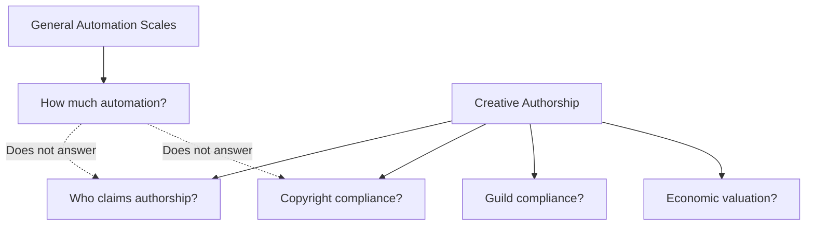
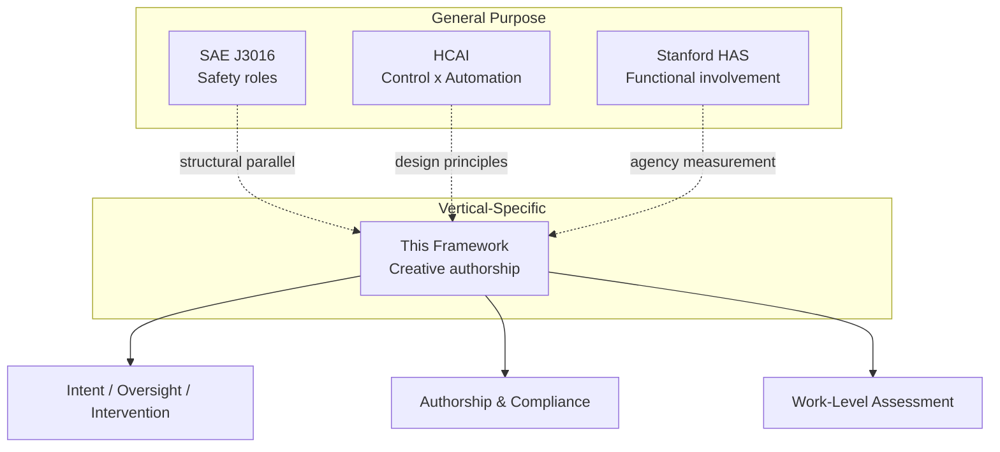
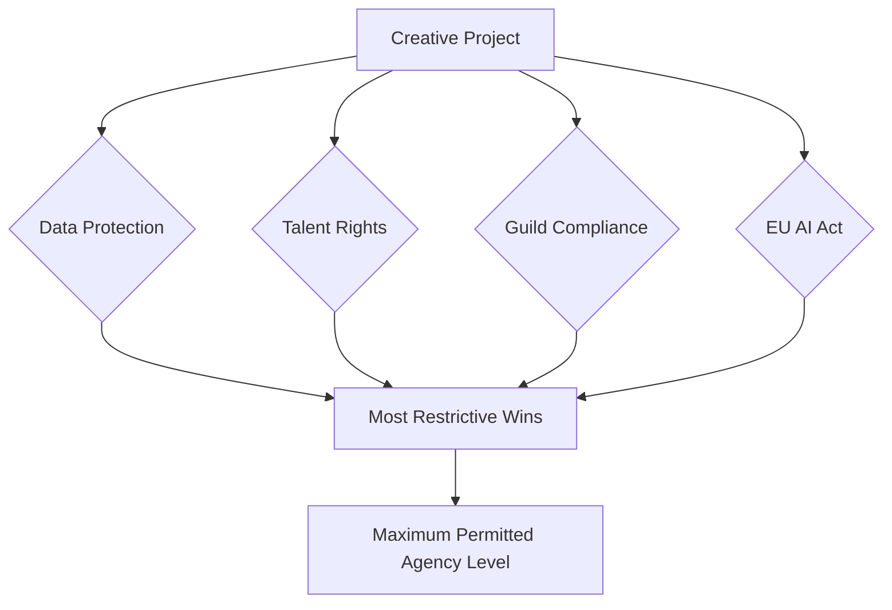

# A Taxonomy of Human-AI Agency in Creative Work

## A Heuristic Framework for Classifying Authorship Configurations in Media and Content Production

**Author:** Mark Ghuneim | **Organization:** Narrative.new | **Version:** 1.0 | 2026

**License:** CC BY 4.0

---

## Abstract

The vocabulary available to describe human-AI collaboration in creative work is inadequate. "AI-generated," "AI-assisted," and "human-written" impose a three-bin classification on what is, in practice, a continuous spectrum of authorship configurations. These terms obscure more than they reveal. Legal standards fare no better: the U.S. Copyright Office requires "significant human control" over expression without specifying what qualifies; guild contracts mandate "human-led" creative processes without defining the threshold; the EU AI Act distinguishes "assistive function" from content that "substantially alter[s] the semantics" without operationalizing either term. Each stakeholder (creators, studios, unions, and tool builders) operates from intuition where precision is needed.

General-purpose automation taxonomies offer structural precedent but not substantive answers. SAE J3016 classifies driving automation through role transitions across six levels, but measures responsibility for a safety-critical physical task, not authorship. Shneiderman's Human-Centered AI framework rejects the zero-sum assumption between control and automation, but provides design principles rather than a classification system. The Stanford Human Agency Scale quantifies functional involvement across occupations, but measures whether a human is *needed* for task completion, not whose authorship claim is defensible.

None of these frameworks account for the constraints specific to creative authorship: copyright law requiring demonstrable human control over expression, guild contracts defining who receives credit and compensation, economic valuation tied to chain of title, or the cognitive distinction between generating original expression and selecting from machine-produced options. These are not edge cases. They are the central questions facing professional media production.

This paper presents a six-level heuristic model (L0-L5) that defines human-AI agency configurations through three descriptive dimensions: **Intent** (who originates creative direction), **Oversight** (who evaluates quality and fitness), and **Intervention** (who modifies the output). The levels describe configurations of creative acts, not properties of tools or persons. A professional safe harbor threshold emerges at the L4/L3 boundary, where legal, professional, cognitive, and economic domains converge on a consistent standard: above this threshold, the human generates; below it, the human selects.

The framework is scoped to media and content production, the vertical where authorship, compliance, and market access intersect most acutely.

---

## 1. Introduction

### 1.1 The Vocabulary Problem

When a screenwriter uses AI to generate three alternative scene transitions and selects one, is that "AI-generated" or "AI-assisted"? When a novelist uses AI to polish dialogue across an entire manuscript, is the result "human-written"? When a showrunner prompts an AI to produce a full episode outline and then revises it substantially, whose creative work is it?

The existing vocabulary cannot answer these questions. "AI-generated" and "AI-assisted" are binary labels applied to a spectrum. They tell you that AI was involved; they tell you nothing about *how* it was involved, *how much* human judgment shaped the result, or *whose authorship claim* is defensible.

This inadequacy creates distinct problems for each stakeholder in the creative ecosystem:

- **Creators** need to know when their authorship claim is secure and when it is diluted. The current vocabulary gives them no gradient, only a cliff edge between "human" and "AI."
- **Studios** need to specify requirements in contracts and assess risk for chain of title. "No AI" is too restrictive; "AI-assisted is fine" is too vague. Neither maps to compliance obligations.
- **Unions** need to define what constitutes member work in an environment where human and machine contributions are entangled. "Human-led" is a standard without a ruler.
- **Tool builders** need to understand which markets their products can serve. A tool classified generically as "AI writing software" faces the same compliance scrutiny whether it operates as a spell-checker or a full draft generator.

The problem is not that people disagree about AI's role in creative work. The problem is that they lack a shared vocabulary precise enough to have the disagreement productively.

Beneath the vocabulary problem lies a conceptual one. The dominant framing asks: "Does the machine write?", treating machine authorship as a binary, discoverable through analysis. Either AI writes or it does not. Either it is an author or it is not. This framing produces arguments, not answers. The productive reframing is architectural: not "does the machine write?" but "how does the system distribute the act of writing between human and machine?" Authorship is not a property that resides in either human or machine; it is a configuration that emerges from how they interact.

### 1.2 Why Media and Content Requires a Vertical Framework

General-purpose automation scales measure *how much* automation is present. Creative authorship requires answering a different question: *who can claim the work*.

Unlike driving automation (SAE J3016) or general workforce task automation (Stanford HAS), creative authorship in media and content production operates under four simultaneous constraints that no general-purpose framework addresses:

**Copyright law requires demonstrable human control over expression.** The U.S. Copyright Office's 2023 guidance establishes that works containing AI-generated material may be registrable only to the extent that a human exercised "significant human control" over the specific creative expression. This is not a question of automation levels; it is a question of who authored the particular words, images, or sounds.

**Guild contracts specify "human-led" processes without measurement.** The WGA's 2023 Minimum Basic Agreement (Article 72) establishes that AI is not a writer and AI-generated material is not "literary material," but also creates an asymmetry where hired writers with company consent can incorporate AI-generated material while retaining literary material status. SAG-AFTRA's four pillars (Transparency, Consent, Compensation, Control) protect performer agency. Neither guild defines a gradient of acceptable involvement.

**Economic valuation depends on authorship clarity.** Chain of title (the unbroken record of who owns what) is the foundation of content licensing, E&O insurance, and market access. Ambiguous authorship creates uninsurable risk. The premium content market requires clean authorship claims; the standard market requires documented claims; the budget market tolerates thin claims. These tiers exist whether or not anyone names them.

**The cognitive distinction between generating and selecting is unique to creative work.** A driver who monitors an autonomous vehicle is performing a safety task. A writer who selects from AI-generated options is performing a curatorial task. Only the latter raises questions of authorship, because authorship requires originating expression, not merely choosing among expressions originated by another.

The printing press offers a useful historical analog. It introduced new roles (typesetter, proofreader, publisher) that distributed aspects of "authorship" across a technological and labor system. But the distribution was legible: everyone understood who wrote the book and who printed it. AI-assisted creative tools create a similar distribution of the act of writing, but the distribution is not legible. The same AI model deployed in a chatbot interface (where the user prompts and the AI generates) produces a different authorship distribution than the same model deployed as an embedded suggestion system (where the user writes and the AI offers phrases). The model is identical; the authorship configuration is not. A taxonomy must make these configurations legible.

General-purpose scales ask: "How much automation is involved?" This framework asks: "Whose authorship is this?"

### 1.3 Paper Structure

Section 2 presents the taxonomy: six levels defined by Intent, Oversight, and Intervention, with the professional safe harbor threshold and the distinction between work-level and interaction-level agency. Section 3 situates this framework against three established taxonomies (SAE J3016, Shneiderman's HCAI, and the Stanford Human Agency Scale), identifying structural parallels and substantive gaps. Section 4 applies the framework to media and content production through the compliance landscape, market structure, and qualitative case studies. Section 5 concludes with limitations and future work.

---

## 2. Taxonomy and Definitions

### 2.1 Design Principles

The taxonomy defines six levels (L0-L5) describing configurations of human-AI interaction in creative work. Each level is characterized by the relationship between human and machine across three descriptive dimensions:

- **Intent:** Who originates the creative direction? At one end, the human conceives the work and the machine executes bounded tasks. At the other, the machine generates content and the human receives it.
- **Oversight:** Who evaluates quality and fitness for purpose? At one end, the human actively judges every output against their creative vision. At the other, the human passively accepts or minimally reviews machine output.
- **Intervention:** Who modifies the output? At one end, the human substantively revises, rewrites, or reshapes material. At the other, the human makes only cosmetic changes or none at all.

These dimensions are descriptive, not prescriptive. They characterize what happens in a creative process, not what should happen. The levels are heuristic ranges, not hard boundaries; creative processes are fluid, and a single session may move across levels as the work progresses.

A critical design choice: the taxonomy describes the *configuration* of a creative act, not a property of the tool or the person. The same AI model deployed in different interfaces produces different agency configurations. The same person using the same tool may operate at different levels depending on the phase of work. The unit of analysis is the interaction between human intent and machine capability, not either in isolation.

### 2.2 The Six Levels

#### L5: Pure Tool

| Dimension | Configuration |
|-----------|--------------|
| **Intent** | Human |
| **Oversight** | Human |
| **Intervention** | Human |

The machine is a passive instrument. It corrects spelling, checks grammar, formats text, or performs mechanical transformations that do not alter creative expression. The human originates, evaluates, and controls all creative content.

**Human role:** Full control over every dimension of the work.
**Machine role:** Passive instrument operating within narrow, deterministic bounds.
**Authorship:** Unambiguous human claim. No disclosure required.
**Example workflow:** A writer uses a word processor with spell-check and grammar correction. The tool flags errors; the writer decides whether to accept corrections. No creative expression originates from the machine.

#### L4: Director

| Dimension | Configuration |
|-----------|--------------|
| **Intent** | Human |
| **Oversight** | Human |
| **Intervention** | Human, with AI assists on command |

The human makes all creative decisions. The machine executes specific, bounded tasks when explicitly directed, generating options that the human evaluates, selects from, and revises. The human remains the architect of the work; the machine is a responsive assistant.

**Human role:** Originates all creative direction. Evaluates all output against their vision. Revises and integrates machine contributions.
**Machine role:** Generates bounded options on command. Does not initiate.
**Authorship:** Clean human claim. The machine's contribution is analogous to a research assistant's: useful but subordinate.
**Example workflow:** A screenwriter prompts AI for three alternative scene transitions, evaluates each against the story's needs, selects one, and rewrites it to match the script's voice and rhythm.

#### L3: Supervisor

| Dimension | Configuration |
|-----------|--------------|
| **Intent** | Human |
| **Oversight** | Human (review and modify) |
| **Intervention** | Shared |

The AI suggests options or produces drafts within human-defined parameters. The human reviews, modifies, and approves, but the machine's contributions are substantive enough that the line between "assisted" and "co-created" begins to blur. Intent remains human-held, but the machine shapes expression.

**Human role:** Sets creative direction. Reviews and substantially modifies machine output. Approves final form.
**Machine role:** Produces substantive drafts or options within human-set parameters.
**Authorship:** Diluted but defensible, provided the human can document their creative oversight and substantive modifications.
**Example workflow:** A writer provides scene parameters (characters, setting, emotional arc) and the AI generates a draft scene. The writer revises dialogue, restructures beats, and rewrites passages; the final scene reflects the writer's judgment, but the AI's draft was the starting point.

#### L2: Collaborator

| Dimension | Configuration |
|-----------|--------------|
| **Intent** | Shared |
| **Oversight** | Shared |
| **Intervention** | Limited human |

The AI produces substantial content. The human's primary role shifts from originating to selecting and editing. Intent is shared: the human provides direction (a premise, a topic, parameters), but the machine generates the expression. The human curates rather than creates.

**Human role:** Provides initial direction. Selects from machine-generated options. Makes editorial (not architectural) changes.
**Machine role:** Generates complete drafts or substantial passages. Shapes expression.
**Authorship:** Diluted. Requires disclosure of AI involvement. Copyright claims are thin.
**Example workflow:** A writer provides a premise and character descriptions. The AI generates full scene drafts. The writer selects the strongest, makes line-level edits, and arranges scenes, but the expression predominantly originates from the machine.

#### L1: Executor

| Dimension | Configuration |
|-----------|--------------|
| **Intent** | Minimal human |
| **Oversight** | Curatorial |
| **Intervention** | Minimal |

The AI generates content with minimal human input. The human's role is primarily curatorial: selecting from outputs, making cosmetic adjustments, but neither originating creative direction nor substantively modifying expression.

**Human role:** Provides a topic or minimal prompt. Selects from generated outputs. Minimal modification.
**Machine role:** Generates substantially all content. Controls expression.
**Authorship:** High risk. No defensible human claim under current copyright standards.
**Example workflow:** A user provides a topic ("Write an article about climate change") and selects from multiple AI-generated articles, making minor edits for tone.

#### L0: Oracle

| Dimension | Configuration |
|-----------|--------------|
| **Intent** | Machine |
| **Oversight** | None or minimal |
| **Intervention** | None |

The AI generates everything. The human receives output without meaningful editorial review or modification. There is no human creative contribution beyond initiating the process.

**Human role:** Receives output. May initiate the process but does not shape it.
**Machine role:** Generates all content autonomously.
**Authorship:** No human claim. The work is machine-generated by any standard.
**Example workflow:** Fully automated content generation: scheduled blog posts, auto-generated reports, synthetic media produced without editorial review.

### 2.3 The Professional Safe Harbor Threshold

The boundary between L4 (Director) and L3 (Supervisor) is the most significant line on the spectrum. It is not arbitrary. Four independent domains converge on the same point, each arriving from different premises but reaching a consistent conclusion about where defensible human authorship begins.

**Legal (USCO).** The U.S. Copyright Office requires "significant human control" over the specific creative expression for copyright registration. At L4 and above, the human holds both Intent and Oversight; the machine's contribution is bounded, commanded, and subordinate. This configuration satisfies the USCO standard. At L3 and below, the machine's contribution to expression grows substantive enough that "significant human control" becomes a question of documentation rather than a structural feature of the process.

**Professional (WGA / SAG-AFTRA).** Guild standards for "human-led" creative work map to configurations where the human directs and the machine assists on command. The WGA's Article 72 does not define a spectrum, but its structure presumes a process where the human is the primary creative agent. Article 72.B establishes that "neither traditional AI nor GAI is a 'writer'" and AI-generated material "shall not be considered literary material." Article 72.C creates a critical asymmetry: when a hired writer uses GAI with company consent, the resulting written material *is* literary material regardless of AI involvement. This protects writer employment (studios cannot replace writers with AI) while preserving writer freedom (writers can use AI as they see fit). The WGA deliberately avoids defining a spectrum of acceptable AI involvement; the contractual protection is binary: writer or not-writer. But this contractual protection does not resolve the copyright question. A writer working at L1 retains WGA credit protections while facing USCO registration challenges. The taxonomy provides the gradient the contract deliberately leaves unspecified.

SAG-AFTRA's four pillars (Transparency, Consent, Compensation, Control) require performer agency over how their contributions are used. The 2025 Interactive Media Agreement specifies that consent must be "written, clear, conspicuous, reasonably specific" and that digital replicas (visual or vocal) require separate consent per use category. Consent is invalidated if use no longer fits the description provided at consent time. Both WGA and SAG-AFTRA frameworks describe a world where the human leads and the machine follows: the L4 configuration.

**Cognitive.** Above the threshold, the human *generates* expression. Below it, the human *selects* from machine-generated options. This is not a quantitative boundary; it is a phenomenological distinction between two different cognitive activities. Writing a sentence and choosing a sentence from a list are different acts, even when the chosen sentence is better than what the writer would have produced. The difference matters for authorship because copyright protects original expression, and "original" implies that the claimant originated it.

The practical test is direct: "Did I write the words, or choose them?" At L4-L5, the answer is unambiguous: the human writes, and the machine assists on command. At L3, the answer is nuanced: the human directs and substantially modifies, but the machine's contribution to expression is non-trivial. At L2 and below, the answer inverts: the machine writes, and the human selects. This cognitive shift from generation to curation is the experiential marker of crossing the safe harbor threshold.

**Economic.** Clean chain of title (the unbroken record of authorship that underpins licensing, insurance, and market access) requires configurations where authorship claims can withstand scrutiny. At L4 and above, the human's role in the creative process is structurally dominant: Intent is human, Oversight is human, and Intervention is human-led. This produces authorship claims that are insurable and defensible. Below L4, claims require increasingly extensive documentation and carry increasing risk.

| Domain | Standard | Satisfied At | Descriptive Test |
|--------|----------|-------------|-----------------|
| Legal (USCO) | "Significant human control" | L4-L5 | Human holds Intent and Oversight |
| Professional (WGA) | "Human-led" | L4-L5 | Human directs; AI assists on command |
| Cognitive | Generating vs. selecting | L4-L5 | Human originates expression |
| Economic | Chain of title | L4-L5 | Authorship claim withstands scrutiny |

The convergence across four independent domains is the argument for treating the L4/L3 boundary as a professional safe harbor: not a legal bright line, but a heuristic threshold below which authorship claims become progressively harder to defend across every relevant domain simultaneously.

### 2.4 Work-Level vs. Interaction-Level Agency

A single prompt-response exchange can sit at L2 while the overall work sits at L4. This is not a contradiction; it reflects the iterative nature of creative processes.

**Interaction-level agency** describes the configuration of a single human-AI exchange: one prompt, one response, one editorial pass. It is the appropriate unit of analysis for evaluating tool behavior, compliance at the moment of generation, and interface design.

**Work-level agency** describes the cumulative configuration across an entire creative process. A screenwriter who spends weeks developing concept, structure, and characters at L5 before using AI at L2 for dialogue polish has a work-level agency that reflects the full process, not just the AI-assisted moments.

The distinction matters because creative phases contribute unequally to authorship. Concept and premise are foundational; dialogue polish is surface-level. A work where the human originated the concept (L5), designed the structure (L4), developed the characters (L5), and used AI to generate dialogue options that they then revised (L3) has a work-level configuration dominated by human Intent and Oversight, even though interaction-level snapshots would show mixed agency.

Work-level agency is what determines authorship claims, copyright registration, credit attribution, and guild compliance. Interaction-level agency is what determines tool evaluation, interface audit, and compliance at the moment of generation.

The original formulation of this framework includes a weighted contribution model that formalizes the relationship between creative phases and their relative significance to authorship. This paper describes the logic qualitatively: high-weight creative decisions (concept, structure, character) contribute more to authorship determination than low-weight execution tasks (formatting, polish, mechanical revision). The implication is that a work can include L2 or L3 interactions at low-weight phases while maintaining an L4 work-level classification, provided the high-weight phases are human-held.

The distinction has practical consequences for when each assessment type applies:

| Context | Use Interaction-Level | Use Work-Level |
|---------|----------------------|---------------|
| Tool feature evaluation | Yes | — |
| Compliance at point of generation | Yes | — |
| Authorship of completed work | — | Yes |
| Credit attribution | — | Yes |
| Copyright registration | — | Yes |
| Guild compliance (work level) | — | Yes |

Work-level agency claims require process evidence: drafts and version history demonstrating iteration, research notes demonstrating pre-prompt development, outlines and treatments demonstrating structural decisions, edit tracking demonstrating post-generation human contribution, and session logs demonstrating cumulative time investment. Without documentation, only interaction-level assessment is possible, and the burden is on the creator to demonstrate aggregate contribution.

---

## 3. Comparative Frameworks

This section situates the taxonomy against three established frameworks for classifying human-machine interaction. The purpose is not critique but calibration: identifying what each framework contributes, what structural features this taxonomy borrows, and where existing frameworks leave gaps that a creative-authorship-specific taxonomy must fill.

### 3.1 SAE J3016: Levels of Driving Automation

**Overview.** SAE J3016 defines six levels (0-5) of driving automation based on the distribution of the Dynamic Driving Task between a human driver and an Automated Driving System (ADS). The levels are defined by role assignment: who monitors the driving environment, who performs steering and acceleration, and who serves as the fallback when the system reaches its limits. The framework's most significant feature is its threshold at Level 3, where responsibility for monitoring shifts from the human driver to the ADS; the human becomes a "fallback-ready user" rather than an active driver.

**Structural parallel.** Both frameworks use six levels with a critical mid-spectrum threshold where the human-machine relationship inverts. SAE's Level 3 marks the transition from "the human drives, the system assists" to "the system drives, the human intervenes when needed." This taxonomy's L4/L3 boundary marks an analogous transition: from "the human creates, the machine assists" to "the machine generates, the human supervises."

Both frameworks define levels by *role assignment* rather than capability metrics. SAE does not measure how sophisticated the driving AI is; it measures who is responsible for what. Similarly, this taxonomy does not measure how capable the AI model is; it measures who holds Intent, Oversight, and Intervention. The parallel is structural: a role-transition model applied to fundamentally different domains.

**Gap for creative work.** SAE measures responsibility for a safety-critical physical task with relatively binary success criteria: the car stays in the lane or it does not. Creative authorship involves subjective quality, legal ownership, and economic valuation, none of which SAE addresses. More specifically:

- SAE has no mechanism for **cumulative assessment**. Each driving moment is independent; there is no concept of "work-level" driving that aggregates across a journey. Creative work is inherently cumulative; authorship of a screenplay emerges from hundreds of creative decisions across weeks of work.
- SAE includes no **compliance layer** for copyright, guild contracts, or IP chain of title. Driving automation operates under safety regulation (NHTSA, UN-ECE); creative authorship operates under intellectual property law, collective bargaining agreements, and market access requirements.
- SAE does not distinguish between **types of human contribution**. A driver who monitors is performing one kind of task. A writer who originates a concept, structures a narrative, develops characters, and polishes dialogue is performing multiple qualitatively different tasks that contribute unequally to authorship. SAE's flat role-assignment model cannot capture this.

SAE J3016 is the closest structural analog to this taxonomy. Its influence is direct: the six-level architecture, the role-transition logic, and the critical threshold are all borrowed. But the substance is entirely different, and must be, because the domains are fundamentally unlike. The transition from "assisted driving" to "automated driving" at SAE Level 3 is a transition of *safety responsibility*. The transition from L4 to L3 in this taxonomy is a transition of *authorship*. Safety and authorship operate under different laws, different institutions, and different standards of evidence.

### 3.2 Shneiderman's HCAI: Two-Axis Model

**Overview.** Ben Shneiderman's Human-Centered AI framework proposes two independent dimensions: Human Control (low to high) and Computer Automation (low to high). The key insight is that these dimensions are *independent*: high automation does not require low human control. The ideal zone is the upper-right quadrant: high automation deployed under high human control, producing systems that are simultaneously powerful and safe. Shneiderman's design metaphors (supertools, active appliances, tele-operated devices) describe how interfaces can be designed to keep humans in the loop without sacrificing machine capability.

**What it shares.** Both frameworks reject binary framing. Where popular discourse asks "human or AI?", both answer "both, in what configuration?" Shneiderman's upper-right quadrant (high control, high automation) maps conceptually to L4 (Director): the AI is highly capable, but the human retains all creative control. Both frameworks emphasize human self-efficacy and agency preservation as design goals, not just ethical aspirations.

Shneiderman's independence thesis is foundational to this taxonomy's design. The six levels do not describe a zero-sum tradeoff where more AI means less human agency. L4 (Director) and L3 (Supervisor) both involve substantial AI capability; the difference is the configuration of human control, not the presence or absence of automation.

**Gap for creative work.** HCAI provides design *principles* but not a *taxonomy*. It tells you what to aim for (upper-right quadrant) but not how to classify where a specific creative process currently sits. The two axes are conceptual, not operationalized for any particular vertical:

- No **authorship implications**. HCAI does not address who owns the output, who receives credit, or whose copyright claim is defensible. These are the central questions for media production.
- No **compliance mapping**. HCAI's design recommendations do not connect to copyright law, guild contracts, EU AI Act obligations, or market access requirements.
- No distinction between **creative agency and functional agency**. HCAI treats "human control" as a single dimension. In creative work, there is a critical difference between controlling a tool (functional agency, e.g., adjusting parameters, starting and stopping generation) and originating creative expression (creative agency, e.g., conceiving a character, structuring a narrative). A user can have maximum functional control over an AI tool while exercising zero creative agency: they control *how* the machine generates but do not originate *what* it generates. This distinction is invisible in HCAI's two-axis model.
- **Static model**. HCAI does not account for how the control-automation configuration shifts across phases of a creative project. A screenwriter may operate in the upper-right quadrant during structural planning (high control, high automation for research) and shift to low control during dialogue generation. Work-level agency requires tracking these shifts; HCAI offers no mechanism for it.

### 3.3 Stanford Human Agency Scale

**Overview.** The Stanford Human Agency Scale (HAS), published in 2025, defines five levels (H1-H5) quantifying the human involvement required for task completion across occupations. H1 represents full AI autonomy (no human needed); H5 represents continuous human involvement required. The scale is based on expert capability assessments and worker preference surveys across 844 tasks in 104 occupations. A key finding: workers consistently prefer more human involvement than experts deem technically necessary.

**The creative agency vs. functional agency distinction.** This framework's relationship to HAS crystallizes the distinction that motivates a vertical-specific taxonomy:

- HAS measures **functional agency**: how much human involvement is *needed* for a task to succeed. The question is capability: "Can the AI do this task?"
- This framework measures **creative agency**: who originates, oversees, and shapes creative expression. The question is authorship: "Whose work is this?"

A task can have low functional agency requirement (the AI can do it competently) and simultaneously high creative agency requirement (a human must claim authorship for the result to have legal, professional, or economic value). AI can generate a competent screenplay, but a screenplay without defensible human authorship cannot be registered for copyright, cannot satisfy guild requirements for "Written By" credit, and cannot anchor a clean chain of title for licensing.

This is why general-purpose scales are insufficient for media and content production. The question is not whether the AI *can* do the work. The question is whether the resulting work has the authorship properties required for professional use.

**Gap for creative work.**

- **Preference-based, not compliance-based.** HAS measures what workers prefer and what experts assess as technically possible. Neither maps to legal requirements. A worker may prefer L4-level involvement while the AI could handle L1, but copyright law, guild contracts, and market access requirements may *demand* L4 regardless of capability or preference.
- **No vertical adaptation.** HAS treats "writing" as a generic task category without distinguishing guild-covered screenwriting from corporate copywriting, literary fiction from marketing content, or theatrical production from social media. These distinctions are operationally critical: the same "writing task" carries entirely different compliance requirements depending on its professional context.
- **No work-level aggregation.** HAS measures tasks, not works. A screenplay is not a single task; it is dozens of tasks (conceiving, structuring, drafting, revising) that contribute unequally to authorship. HAS offers no mechanism for aggregating across creative phases.
- **No authorship, copyright, or IP implications.** HAS is designed for workforce planning and automation forecasting. It does not address who owns the output, who receives credit, or how the result maps to legal and professional standards.

The preference-compliance gap is worth emphasizing. HAS found that workers prefer more human involvement than experts deem necessary. In media production, the gap runs in the opposite direction: *compliance demands more human involvement than many creators might prefer*. A screenwriter might find it efficient to work at L2, generating full drafts from premises, but guild contracts, copyright standards, and market access requirements may demand L4. The binding constraint is not worker preference or expert capability assessment; it is the intersection of legal, professional, and economic standards. This is precisely the gap a vertical-specific taxonomy must address.

### 3.4 Synthesis: What This Framework Adds

The three frameworks above contribute essential structural insights. SAE J3016 provides the precedent of a role-transition model with a critical mid-spectrum threshold. Shneiderman's HCAI establishes that control and automation are independent variables, not a zero-sum tradeoff. The Stanford HAS demonstrates the value of systematic level-based classification across tasks and occupations.

What none of them provides, and what creative authorship in media production requires, is a taxonomy that simultaneously addresses authorship, compliance, and market access through dimensions specific to creative work.

| Dimension | SAE J3016 | Shneiderman HCAI | Stanford HAS | This Framework |
|-----------|-----------|-----------------|-------------|---------------|
| Structure | 6 levels | 2 axes / 4 quadrants | 5 levels | 6 levels |
| Defines levels by | Role responsibility | Control x Automation | Involvement needed | Intent, Oversight, Intervention |
| Critical threshold | L3 (responsibility shift) | Upper-right quadrant | None specified | L4/L3 (safe harbor) |
| Authorship implications | No | No | No | Yes |
| Compliance mapping | No | No | No | Yes (legal, guild, EU) |
| Work-level assessment | No | No | No | Yes |
| Creative vs. functional agency | N/A | Implicit | Functional only | Explicit |
| Vertical-specific | Driving | General | General workforce | Media/content |

This framework complements rather than replaces general-purpose taxonomies. It borrows SAE's role-transition architecture, extends Shneiderman's independence thesis into an operationalized classification, and distinguishes creative agency from the functional agency that HAS measures. The contribution is vertical specificity: a taxonomy designed for the domain where authorship, compliance, and market access intersect.

The gap is not in the quality of existing frameworks; each is well-designed for its domain. The gap is in the assumption that a single general-purpose scale can serve all verticals. Driving automation, general workforce planning, and creative authorship face different constraints, serve different stakeholders, and require different classification criteria. SAE J3016 does not need to address copyright because cars do not have authors. HCAI does not need to map to guild contracts because its scope is design principles, not compliance. HAS does not need work-level aggregation because it measures tasks, not works. This taxonomy needs all three, and that is why it exists.

---

## 4. Vertical Implementation: Media and Content Production

### 4.1 The Compliance Landscape

Four compliance dimensions operate simultaneously on every professional AI-assisted media production. Each independently constrains which agency configurations are permissible. Their intersection defines what is actually allowed for any given project.

**Data Protection:** *What can the AI access?* The sensitivity of material being processed (released content, development IP, unreleased tentpole assets) determines infrastructure requirements. Lower agency levels generate more content, which means more data exposure. More sensitive IP requires more infrastructure protection. These scale together.

**Talent Rights (SAG-AFTRA):** *Whose likeness can the AI use?* Performer likeness triggers consent requirements that constrain agency levels. Digital replicas (de-aging, voice cloning, posthumous performance) require the highest consent tier and are restricted to L4-L5 configurations where the performer retains control. SAG-AFTRA's 2025 Interactive Media Agreement requires that consent be "written, clear, conspicuous, reasonably specific" and that performers can suspend consent for new material generation during a strike.

**Guild Compliance (WGA / DGA / IATSE):** *Who gets credit and compensation?* The WGA's Article 72 creates an asymmetry: studios cannot claim AI-generated content as literary material at any level (72.B), but hired writers with company consent can incorporate AI-generated material while retaining literary material status (72.C). This protects writer employment while leaving the copyright question (whether the work satisfies USCO's "significant human control" standard) unresolved. SAG-AFTRA prohibits replacing performance with generation. The DGA requires director approval for AI use in directorial decisions.

**International Regulation (EU AI Act, Article 50):** *Is the output marked as AI-generated?* Article 50's transparency obligations, enforceable from August 2, 2026, require machine-readable marking of AI-generated outputs, but exempt content where the AI performs an "assistive function" that does not "substantially alter the semantics" of human input. This exemption maps to L3-L5 configurations; L0-L2 outputs require marking. For creative works, disclosure obligations are "limited to disclosure of the existence of such generated or manipulated content in an appropriate manner that does not hamper the display or enjoyment of the work."

The EU implicitly recognizes a spectrum in its regulatory language. "Substantially alter semantics" is a threshold, not a binary, and the "assistive function" exemption acknowledges that some AI uses are subordinate to human creative intent while others are not. This framework operationalizes what the regulation describes: the distinction between AI that assists (L3-L5) and AI that generates (L0-L2). Tools serving European markets must implement marking systems for L0-L2 outputs while L3-L5 assistive tools remain exempt.

| Agency Level | EU AI Act Status | Rationale |
|-------------|-----------------|-----------|
| L0-L2 | Marking required | AI substantially alters semantics; generates content |
| L3-L5 | Assistive function exemption | Human controls semantics; AI assists without substantial alteration |

**The rule: most restrictive constraint wins.** A project's effective agency ceiling is set by whichever compliance dimension imposes the tightest requirement. A guild-covered streaming series with recognizable performers and unreleased IP must satisfy all four dimensions simultaneously, and the most restrictive one determines the floor.

These compliance dimensions do not exist in driving automation or general workforce task automation. They are specific to media production, and they are why a vertical framework is necessary.

**How compliance creates market structure.** The four dimensions intersect differently depending on project profile. A tentpole film with A-list cast and guild coverage requires maximum data protection, Tier 3 talent consent (digital replica protocols), full guild compliance, and EU marking exemption at L4-L5, resulting in L4-L5 only, on-premise infrastructure. A streaming series in development with guild coverage requires enhanced data protection, Tier 1-2 consent, full guild compliance, resulting in L3-L5, dedicated cloud. An independent film with no stars and no guild coverage has standard data protection, Tier 0-1 consent, no guild requirements, opening L2-L5 on standard cloud. Social content with stock footage and no talent has no meaningful constraints at any level.

The decision flowchart for any project follows three questions in sequence:

1. **What is the most sensitive data involved?** This sets the infrastructure tier. Unreleased tentpole IP requires air-gapped or on-premise environments; development IP requires dedicated cloud instances; released content can use shared cloud.
2. **Does the project involve recognizable talent?** This sets the consent tier. Digital replicas require enhanced consent with legal review; recognizable alterations require standard SAG-AFTRA consent; background or unrecognizable use requires notification only.
3. **Is the work guild-covered?** This sets the minimum permissible agency level. Guild-covered work requires L3 minimum (with documentation) or L4 (clean compliance). Non-guild work has no agency floor beyond the creator's own risk tolerance.

The most restrictive answer wins. A project that is L5-safe on data protection but L4-minimum on guild compliance and L4-minimum on talent consent operates at L4 minimum. One dimension at L5 does not offset another at L4.

### 4.2 The Three-Tier Market

Compliance constraints do not merely restrict; they stratify. The intersection of data protection, talent rights, guild requirements, and international regulation creates a market with three distinct tiers, each defined by the agency configurations it permits and the content it produces. This structure is not imposed by any single authority; it emerges from the convergence of independent constraints.

| Constraint | Premium Requirement | Standard Requirement | Budget Tolerance |
|-----------|-------------------|---------------------|-----------------|
| Copyright | Clean (L4-L5) | Diluted acceptable (L3) | Thin acceptable (L2) |
| Guild compliance | Required (all unions) | Required | Not applicable |
| Talent consent | Tier 3 protocols | Tier 1-2 protocols | Tier 0-1 |
| Data protection | Maximum or enhanced | Enhanced | Standard |
| E&O insurance | Full coverage | Standard coverage | Minimal |

**Premium (L4-L5).** Theatrical releases, prestige television, awards-track content. Clean authorship is required: full chain of title, insurable copyright claims, guild compliance across all unions. A-list talent participation triggers the highest consent requirements. Data protection demands maximum or enhanced infrastructure. Tools serving this tier must support L4-L5 modes with enterprise-grade security, consent management integration, and guild-compliant audit trails.

**Standard (L3).** Network television, streaming originals, mid-budget productions. Authorship is diluted but defensible with documentation. Disclosure of AI involvement is required. Guild compliance is necessary but operates in the negotiated gray zone where human creative leadership must be demonstrated through process evidence. Tools serving this tier must support L3-L5 modes with dedicated cloud infrastructure and contribution tracking.

**Budget (L2).** Digital-first content, non-guild productions, volume content. Thin margins, speed prioritized over authorship clarity. Copyright claims are thin; IP value is limited. Tools serving this tier can operate on standard cloud infrastructure with basic attribution. Licensing complications are accepted as a cost of speed.

**Below L2 (L0-L1):** Locked out of professional markets entirely. Tools that only support L0-L2 configurations cannot serve premium or standard tiers. Their addressable market is budget-tier and non-professional use cases.

The implication for tool builders: compliance capability is competitive positioning. A tool's addressable market is determined not by its AI capability but by the agency configurations it supports and the infrastructure it provides. Tools that support the full L2-L5 range with appropriate infrastructure options can serve all three tiers. Tools that only support L0-L2 are excluded from premium and standard markets entirely; their addressable market is budget-tier and non-professional use cases. The compliance capability becomes the competitive moat.

| To Serve This Market | Tool Must Support |
|---------------------|-------------------|
| **Premium** | L4-L5 modes, enterprise-grade security, consent management, guild-compliant audit trails |
| **Standard** | L3-L5 modes, dedicated cloud instances, disclosure generation, contribution tracking |
| **Budget** | L2-L5 modes, standard cloud acceptable, basic attribution |

The three-tier structure is the most probable market outcome. An alternative scenario (polarization between Premium/human-only and Budget/AI-heavy, with the Standard tier collapsing) is possible but less likely, because the economics of mid-budget content (streaming series, network television) depend on efficient production processes that L3 configurations enable. Full automation (L0-L2 domination across all tiers) is the least probable outcome, constrained by copyright law, guild contracts, and the economic premium that defensible authorship commands. The three-tier equilibrium represents the intersection of what is legally permissible, professionally acceptable, and economically viable at each level.

### 4.3 Qualitative Case Studies

Three scenarios demonstrate how the taxonomy applies in practice. Each illustrates the gap between interaction-level snapshots and work-level authorship assessment.

#### Case A: Feature Screenplay Development

A professional screenwriter develops an original feature over six weeks:

| Creative Phase | Agency Level | Weight | Configuration |
|---------------|-------------|--------|---------------|
| Concept and premise | L5 (Pure Tool) | High | Human-originated, no AI involvement |
| Dramatic structure | L4 (Director) | High | Human directs; AI suggests structural options on command |
| Character development | L5 (Pure Tool) | High | Human-driven |
| Dialogue drafting | L2 (Collaborator) | Low | AI generates; human selects and edits |
| Revision and polish | L4 (Director) | Moderate | Human directs revision passes |

**Work-level classification: L4 (Director).** The high-weight phases (concept, structure, character) are held at L4-L5. The low-weight phase (dialogue drafting) used AI more heavily, but does not dominate the work-level assessment because its contribution to authorship is structurally subordinate.

**Authorship assessment:** Defensible. Clean chain of title. The writer can demonstrate that they originated the concept, designed the structure, developed the characters, and directed all revisions. The AI's contribution to dialogue drafting is bounded and documented.

#### Case B: TV Episode, Writers' Room Simulation

A solo writer uses AI as a brainstorming partner for a one-hour pilot:

| Creative Phase | Agency Level | Weight | Configuration |
|---------------|-------------|--------|---------------|
| Series bible creation | L5 (Pure Tool) | High | Human-originated |
| Episode concept | L4 (Director) | High | Human-led with AI options |
| Beat sheet development | L3 (Supervisor) | Moderate | AI drafts, human substantially revises |
| Scene outlining | L3 (Supervisor) | Moderate | AI drafts, human reviews and modifies |
| First draft | L2 (Collaborator) | Moderate | AI generates from outlines, human curates |
| Dialogue and polish | L4 (Director) | Low | Human-directed revision passes |

**Work-level classification: L3 (Supervisor).** Heavier AI involvement at L2-L3 across most mid-weight phases pulls the overall work below the safe harbor threshold. The series bible and episode concept (high-weight, L4-L5) anchor the authorship claim, but the first draft phase (moderate-weight, L2) dilutes it substantially.

**Authorship assessment:** Diluted but defensible, with documentation. The writer must demonstrate creative oversight through the series bible, beat sheet decisions, and substantive revisions to AI-generated material. The series bible is the critical evidence: it establishes that the human originated the world, characters, and thematic arc before any AI involvement. Without process evidence, this work-level classification collapses toward L2, and the authorship claim becomes difficult to defend under USCO standards.

**Compliance implications:** Under the WGA's Article 72.C, if this writer is a hired writer with company consent, the resulting material retains literary material status regardless of AI involvement; the contractual protection holds. However, the copyright question remains independent: USCO registration requires demonstrating "significant human control" over the specific expression, and L3 work-level agency places this in the zone where documentation makes or breaks the claim. For guild-covered production, this configuration requires disclosure and careful record-keeping.

#### Case C: Novelist Self-Adaptation

A novelist adapts their own published work into screenplay format:

- **The session:** 30 minutes. The novelist pastes a novel excerpt and prompts: "Convert to screenplay format with cinematic dialogue." The AI generates two pages. The novelist makes minor edits.
- **Interaction-level assessment: L1.** The AI generated most of the output; the novelist primarily accepted.
- **But the novelist wrote the source material.** The novel, the characters, the world, the story arc: all prior L5 work spanning years.

**Work-level classification: L4 (Director).** The interaction-level snapshot is misleading. The novelist is leveraging years of original creative work. The AI is performing format conversion on human-authored material. The novelist's authorship of the underlying work (concept, structure, character, narrative) dominates the work-level assessment.

**Key insight:** The same interaction-level prompt ("convert this to screenplay format") produces entirely different work-level classifications depending on who authored the source material. A random user with the same prompt operates at L1 work-level. The novelist operates at L4 work-level. The difference is what the human brings to the interaction.

| Scenario | Interaction Agency | Work-Level Agency |
|----------|-------------------|-------------------|
| Novelist adapting own work | L1 | L4 |
| Random user with same prompt | L1 | L1 |

This case demonstrates the "Photographer Principle": a digital camera "generates" the image at shutter-click, but authorship resides in the cumulative process (subject selection, composition, timing, lighting decisions, post-processing). If photography were scored only at the moment of generation, no photographer would have an authorship claim. The same principle applies to AI-assisted creative work: the generation moment is one step in a larger creative process. A prompt that appears L1 in isolation may be the culmination of years of L5 creative development.

#### Implications for Stakeholders

These cases demonstrate that the taxonomy serves different stakeholders in different ways:

- **For creators:** The framework provides a diagnostic: where does my process sit, and is my authorship claim defensible? Creators operating at L4-L5 across high-weight phases can use AI freely at low-weight phases without jeopardizing their authorship. Creators operating at L3 must invest in documentation.
- **For studios:** The framework provides a specification language. Rather than "no AI" or "AI is fine," studios can require "L4 minimum for concept and character development; L3 acceptable for scene drafting with documentation." This precision reduces ambiguity in production agreements.
- **For unions:** The framework provides a measurement basis. "Human-led" can be defined operationally as "Intent and Oversight held by the human across high-weight creative phases." This gives guild negotiators specific language for contract provisions.
- **For tool builders:** The framework provides market segmentation. A tool that supports L4-L5 configurations with audit trails can serve premium markets. A tool that only supports L1-L2 configurations is confined to budget and non-professional use.

#### Observations Across Cases

- **Work-level agency is typically higher than interaction-level** when the human performs substantial creative work outside of AI-assisted sessions. The gap can be significant: Case C shows a three-level difference between interaction-level (L1) and work-level (L4) assessment.
- **The weight of creative phases matters more than time spent.** Hours on dialogue polish at L2 contribute less to authorship than hours on concept development at L5. This reflects the structure of authorship itself: foundational creative decisions (what the story is about, who the characters are) define the work more than surface-level expression.
- **Documentation is essential at L3.** The difference between defensible and indefensible authorship claims at L3 often reduces to whether the creator can demonstrate their process. Process evidence includes drafts and version history (demonstrating iteration), research notes (demonstrating pre-prompt development), outlines and treatments (demonstrating structural decisions), edit tracking (demonstrating post-generation human contribution), and session logs (demonstrating cumulative time investment). Without documentation, only interaction-level assessment is possible, and the burden is on the creator to demonstrate aggregate contribution.
- **Both assessments serve different purposes.** Interaction-level for tool evaluation and compliance at the point of generation; work-level for authorship claims, credit attribution, and copyright registration.
- **Prior work counts.** Users adapting their own material have legitimate authorship claims even when the adaptation session itself is low-agency. The taxonomy must account for the full creative history, not just the AI-assisted moments.

---

## 5. Conclusion

### 5.1 Summary

This paper presents a six-level heuristic taxonomy for classifying human-AI agency configurations in creative work. The levels (L0-L5) are defined by three descriptive dimensions (Intent, Oversight, and Intervention) that characterize the distribution of creative control between human and machine. The taxonomy is designed for media and content production, the vertical where authorship, compliance, and market access intersect most acutely.

The professional safe harbor at the L4/L3 boundary emerges from the convergence of four independent domains: legal standards requiring demonstrable human control, guild contracts requiring human-led processes, the cognitive distinction between generating and selecting expression, and economic requirements for insurable chain of title. This convergence is the framework's central empirical claim: that these four domains, arriving from different premises, draw a consistent line at the same point on the spectrum.

The distinction between interaction-level and work-level agency addresses the iterative nature of creative work. A single AI-assisted interaction does not determine authorship of a completed work; the cumulative configuration across all creative phases, weighted by their significance to authorship, is what matters for copyright, credit, and compliance.

The compliance landscape (data protection, talent rights, guild contracts, and international regulation) creates a market structure with three tiers (Premium, Standard, Budget) defined by the agency configurations each permits. Tools and productions position themselves within this structure based on their compliance capability, not their AI capability. The framework provides the vocabulary for each stakeholder to navigate this structure: creators can assess their authorship risk, studios can specify contractual requirements, unions can define member work, and tool builders can identify their addressable market.

### 5.2 Relationship to Existing Frameworks

The taxonomy borrows SAE J3016's role-transition architecture: six levels defined by who is responsible for what, with a critical mid-spectrum threshold where the human-machine relationship inverts. It extends Shneiderman's insight that control and automation are independent variables, operationalizing it for creative authorship through Intent, Oversight, and Intervention. It distinguishes creative agency (who originates expression) from the functional agency (how much human involvement is needed) that the Stanford HAS measures.

The framework complements rather than replaces general-purpose taxonomies. SAE J3016 remains the right tool for driving automation. HCAI remains the right framework for design principles. HAS remains the right scale for workforce planning. This taxonomy addresses a gap none of them fills: classifying authorship configurations in a domain where legal, professional, cognitive, and economic constraints are specific and simultaneous.

### 5.3 Limitations

**Scope.** The taxonomy is focused on text-based creative processes in the pre-rendering, pre-visualization phase. Multimodal concerns (voice synthesis, visual generation, performance capture) are addressed only where they intersect with writing (specifically, talent rights and SAG-AFTRA consent requirements). Full treatment of multimodal authorship requires extension, particularly as AI-generated voice and image become more capable and more integrated into production pipelines.

**Boundary precision.** The six levels are heuristic ranges, not precise boundaries. Creative processes are fluid, and reasonable practitioners may classify the same process differently. The value is in consistent directional classification, not false precision.

**Jurisdictional focus.** The compliance landscape centers on U.S. copyright law, U.S. guild contracts, and EU AI Act provisions. Other jurisdictions may require adaptation, particularly those with different copyright traditions. Moral rights regimes (prevalent in continental Europe and much of the world outside the U.S.) may shift the safe harbor threshold, since moral rights attach to the author's personality and are generally inalienable, creating additional constraints on AI-assisted work that U.S. copyright's economic focus does not impose.

**Behavioral constraints.** Five behavioral constraints erode agency in practice even when tools formally provide control (Tversky & Kahneman, 1974; Thaler & Sunstein, 2008). *Anchoring bias* causes the AI's first suggestion to become the gravitational center of the creative space, as even rejected options shape what feels "reasonable" (Tversky & Kahneman, 1974). *Selection bias* operates through three invisible filters (training data, platform incentives, prompt constraints) that shape which options appear before the user sees anything. *Cognitive friction* creates asymmetric effort: accepting a suggestion costs one click; rejecting it and generating an alternative requires evaluating, deciding, creating, and comparing (Johnson & Goldstein, 2003; Thaler & Sunstein, 2008). Studies on code completion interfaces (Vaithilingam et al., 2022) and machine translation post-editing (Green et al., 2013) confirm that acceptance rates increase and error detection decreases when users shift from generation mode to approval mode. *The Overton window effect* means that AI-suggested options define the space of "reasonable" choices, and options not presented are options not considered. *Homogenization at scale* produces cultural convergence when millions of users receive similar suggestions from similar models trained on similar data, even when every individual user technically "chose."

The taxonomy describes the *configuration* of a creative act, not the *effective agency* the human exercises within that configuration. A user operating at L4 in structural terms may experience L3-level effective agency due to anchoring effects. This gap between formal and effective agency is the taxonomy's most significant limitation, and the most important area for future work.

**Empirical validation.** The safe harbor threshold is a synthesis of qualitative standards, not an empirically measured boundary. The convergence of four domains at the L4/L3 boundary is the framework's central claim, but it has not been empirically tested. Validating whether L4 configurations reliably produce defensible authorship claims, and whether L3 configurations reliably require documentation to be defensible, across diverse creative contexts requires longitudinal empirical study. Until such validation exists, the threshold should be treated as a heuristic guide, not a regulatory standard.

### 5.4 Future Work

**Effective agency measurement.** Developing methods to measure the gap between formal agency (the level the taxonomy assigns) and effective agency (the creative control the human actually exercises), accounting for behavioral constraints.

**Multimodal extension.** Extending the taxonomy to voice synthesis, visual generation, and performance capture, domains where talent rights, likeness consent, and guild compliance create additional constraints beyond those addressed here.

**Longitudinal skill tracking.** The "Reversibility Test" (whether a creator can complete a task without AI) is a personal diagnostic. Longitudinal studies tracking creator skill maintenance across agency levels would provide empirical grounding for concerns about dependency.

**International regulatory adaptation.** Mapping the taxonomy to jurisdictions beyond U.S./EU, particularly those with moral rights traditions that may shift the safe harbor threshold.

**Tool certification.** Third-party audit and certification of AI tools' agency level support, analogous to Shneiderman's governance tiers. Such certification would give studios, guilds, and creators a basis for specifying tool requirements in contracts.

**Guild contract integration.** The 2025-2027 negotiation window for WGA, SAG-AFTRA, DGA, and IATSE contracts presents an opportunity to align contract language with a shared taxonomy. The framework provides vocabulary that guild negotiators and studio representatives could use to specify, rather than gesture at, the configurations they intend. The current WGA approach (binary: AI is not a writer) and the SAG-AFTRA approach (four pillars without granularity) could both be complemented by a shared classification that makes "human-led" operationally precise.

**Suggest/Publish interface audit.** The distinction between suggest mode (opt-in, where the default is rejection) and publish mode (opt-out, where the default is acceptance) is a primary determinant of effective agency. A systematic audit of major AI writing tools' default modes, and the gap between formal agency level and effective agency level under each mode, would provide evidence for interface design standards that preserve authorship.

**Cross-vertical adaptation.** While this paper focuses on media and content production, the underlying architecture (levels defined by Intent, Oversight, and Intervention, with a compliance-driven safe harbor) may be adaptable to other creative verticals:

- Music composition (performance rights, mechanical rights, sampling clearance)
- Visual art (copyright registration for AI-assisted images, gallery and auction market standards)
- Game design (player experience authorship, procedural generation, interactive narrative)
- Architectural design (professional licensing, building code compliance, client ownership)

Each vertical has its own compliance landscape and authorship standards; the question is whether the three-dimensional framework transfers when the specific compliance constraints change.

---

## References

### Foundational Human-AI Interaction

Shneiderman, B. (2022). *Human-Centered AI.* Oxford University Press.

Shneiderman, B. (2020). Human-Centered Artificial Intelligence: Reliable, Safe & Trustworthy. *International Journal of Human-Computer Interaction*, 36(6), 495-504.

SAE International. (2021). *J3016: Taxonomy and Definitions for Terms Related to Driving Automation Systems for On-Road Motor Vehicles.* SAE International.

Shao, Y. et al. (2025). Future of Work with AI Agents: Auditing Automation and Augmentation Potential. Stanford University. arXiv:2506.06576.

### Legal and Regulatory

U.S. Copyright Office. (2023). Copyright Registration Guidance: Works Containing Material Generated by Artificial Intelligence. *Federal Register*, 88(51), 16190-16194.

Writers Guild of America. (2023). *Minimum Basic Agreement*, Article 72: Artificial Intelligence.

SAG-AFTRA. (2023). *TV/Theatrical Contract*, AI Provisions.

SAG-AFTRA. (2025). *Interactive Media Agreement*, Digital Replica Definitions and Four Pillars of Ethical AI.

Directors Guild of America. (2023). *Basic Agreement*, AI Provisions.

European Parliament and Council. (2024). *Regulation (EU) 2024/1689* (AI Act), Article 50: Transparency Obligations for Providers and Deployers of Certain AI Systems.

### Behavioral Economics and Human-Computer Interaction

Tversky, A. & Kahneman, D. (1974). Judgment under Uncertainty: Heuristics and Biases. *Science*, 185(4157), 1124-1131.

Johnson, E.J. & Goldstein, D. (2003). Do Defaults Save Lives? *Science*, 302(5649), 1338-1339.

Thaler, R. & Sunstein, C. (2008). *Nudge: Improving Decisions About Health, Wealth, and Happiness.* Yale University Press.

Vaithilingam, P., Zhang, T., & Glassman, E.L. (2022). Expectation vs. Experience: Evaluating the Usability of Code Generation Tools Enabled by Large Language Models. *Proceedings of the 2022 CHI Conference on Human Factors in Computing Systems*.

Green, S., Heer, J., & Manning, C.D. (2013). The Efficacy of Human Post-Editing for Language Translation. *Proceedings of the 2013 CHI Conference on Human Factors in Computing Systems*, 439-448.

### Industry

OpenAI-News Corp Partnership. (2024). Content licensing agreement for AI training and output.

Suno-Warner Music Group Partnership. (2024). Music licensing agreement establishing commercial use rights.

Authors Guild v. OpenAI. (Ongoing). Litigation over fair use boundaries for training on copyrighted text corpora.

---

> **Author:** Mark Ghuneim
> **Organization:** Narrative.new
> **Version:** 1.0 | 2026
>
> **Suggested Citation:**
> Ghuneim, M. (2026). *A Taxonomy of Human-AI Agency in Creative Work: A Heuristic Framework for Classifying Authorship Configurations in Media and Content Production.* Narrative.new.
>
> License: CC BY 4.0
